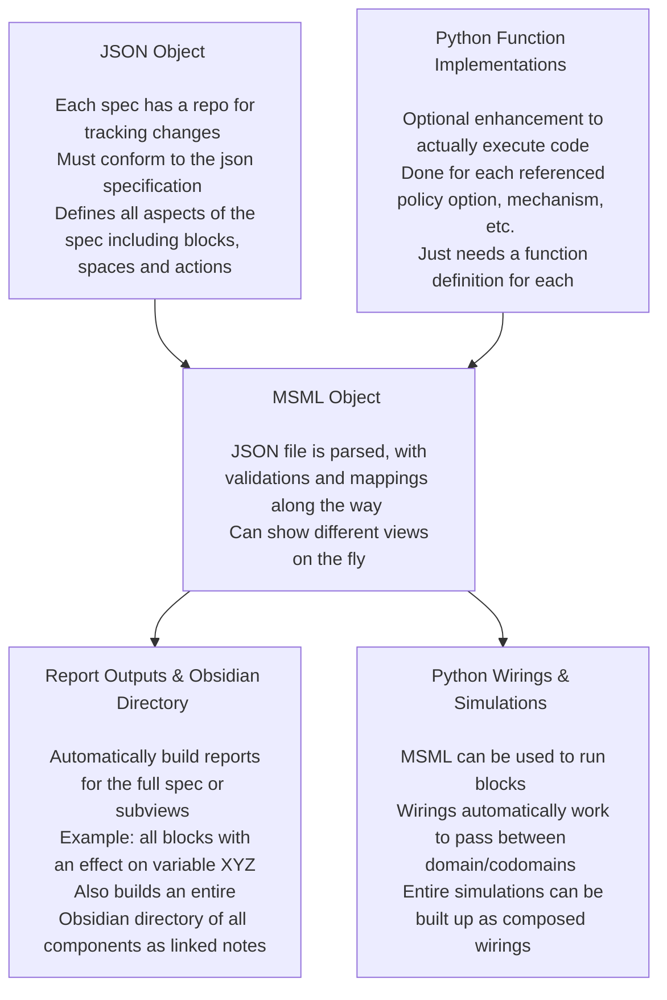
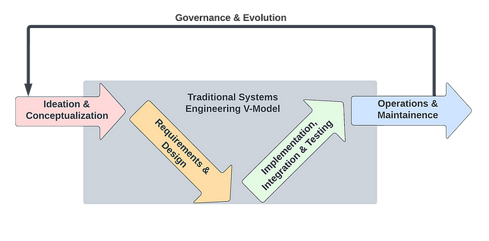

# MSML

## What is the Mathematical Specification Mapping Library (MSML)?

MSML is a library for standardizing the creation of mathematical specifications as JSON objects as well as aiding in the automation of report and visualization creation from these standardized JSON. 

It uses block diagram wirings and spaces to represent the actions in complex systems in line with current BlockScience research on Generalized Dynamical Systems. It also adds some enhancements to the primitive blocks to represent richer sets of behaviors.

One good example is the [wiring report](https://github.com/SeanMcOwen/Root-Finding-Simulation/blob/main/MSML/reports/Simulation%20Block.md) for the Root Finding Simulation canonical example.

## Installing the library

To install the library, simply pip install by running "pip install math_spec_mapping"

## Why MSML?

Writing mathematical specifications can be a difficult process, especially when variable names are changed or new mechanisms are introduced. MSML seeks to streamline the process with automations as well as enhance the abilities of static math specs to deliver deeper insights. Because it is automated, one can write specifications at different levels of details or for different purposes.

## What are some of the solutions offered?

- **Automation**: Automate writing of a specification
- **Standardization**: Ensure standardization across teams working to spec out a system
- **Flexibility**: Allow for creating views on the fly and in multiple ways depending on what stakeholders find important
- **Trackability**: Keep a repository of a JSON file to track changes to the spec with the same enhancements git provides for projects already

## How does MSML work?

## MSML in the Engineering Lifecycle

The engineering lifecycle as defined and visualized in ["Block by Block: Managing Complexity with Model-Based Systems Engineering"
](https://blog.block.science/block-by-block-managing-complexity-with-model-based-systems-engineering/) is depicted below.

MSML can aid in all five of these phases in different ways.

### Ideation and Conceptualization

During ideation phases, users of MSML can leverage the markdown writing tool to begin organizing different thoughts into components. For example, if one were trying to model a system that has multiple currencies, i.e. USD and the Euro, those could be added in as MSML types as they are discovered. The markdown report writing supports wiki-links for use in Obsidian or a similar tool allowing users to iteratively catalog different components they find in their research and ideation. 

### Requirements and Design

When moving into requirements and design, MSML provides a suite of reports so that presentations to stakeholders can be insightful but tailored to the different audiences. Feedback can be iteratively incorporated into the spec with reports being re-run.

### Implementation, Integration, and Testing

In its basic form, a spec from MSML can be used to guide implementations because blocks can be transformed into actual code/functions and spaces act as the parameterizations of those functions. There is also experimental work being done on meta-programming so that MSML could either template simulation models or even be used to hold and write code where applicable for things such as A/B testing.

### Operations and Maintenance

Thanks to some of the more advanced features, MSML can be used as an aid for debugging and system validation. The functionality around seeing what parameters effect which blocks directly or downstream indirectly helps developers quickly identify root causes of issues. The linkages between mechanisms and what pieces of state they update allows for developers to quickly see all possible paths to variable changes there are in case something looks amiss.

### Governance and Evolution

The ability to fork the repository of an MSML spec as well as the ability to use it for A/B testing with the policy options makes it well suited for iterating on model evolution. 

## Technical Details

The documentation on the technical details of using the MSML can be found [here](https://github.com/BlockScience/MSML/tree/main/docs)

## Canonical Examples

[Dummy/Starter Repository](https://github.com/BlockScience/MSML/tree/main/examples/StarterRepo)
[Root Finding Simulation](https://github.com/SeanMcOwen/Root-Finding-Simulation)

### Comparison of Canonical Example Features

| Feature | Dummy | Root Finding |
| --- | --- | --- |
| Action Transmission Channels | X | X |
| Stack Block | X | X |
| Parallel Block |  | X |
| Split Block |  |  |
| Boundary Actions | X |  |
| Control Actions | X | X |
| Entities | X |  |
| Mechanisms | X | X |
| Parameters | X | X |
| Policies | X | X |
| Spaces | X | X |
| State | X | X |
| Stateful Metrics |  |  |
| State Update Transmission Channels | X | X |
| Reports | X | X |

##  Other Related Repositories

[GDS-MSML-cadCAD Repository](https://github.com/BlockScience/GDS-MSML-cadCAD)