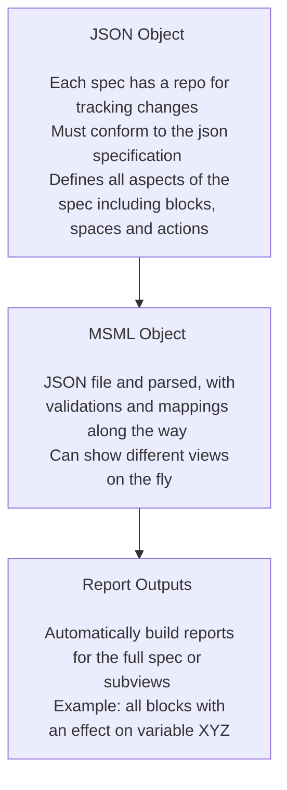

# MSML

## What is the Mathematical Specification Mapping Library (MSML)?

MSML is a library for standardizing the creation of mathematical specifications as JSON objects as well as aiding in the automation of report and visualization creation from these standardized JSON. 

It uses block diagram wirings and spaces to represent the actions in complex systems in line with current BlockScience research on Generalized Dynamical Systems. It also adds some enhancements to the primitive blocks to represent richer sets of behaviors.

One good example is the [wiring report](https://github.com/SeanMcOwen/Root-Finding-Simulation/blob/main/MSML/reports/Simulation%20Block.md) for the Root Finding Simulation canonical example.

## Why MSML?

Writing mathematical specifications can be a difficult process, especially when variable names are changed or new mechanisms are introduced. MSML seeks to streamline the process with automations as well as enhance the abilities of static math specs to deliver deeper insights. Because it is automated, one can write specifications at different levels of details or for different purposes.

## What are some of the solutions offered?

- **Automation**: Automate writing of a specification
- **Standardization**: Ensure standardization across teams working to spec out a system
- **Flexibility**: Allow for creating views on the fly and in multiple ways depending on what stakeholders find important
- **Trackability**: Keep a repository of a JSON file to track changes to the spec with the same enhancements git provides for projects already

## How does MSML work?

## MSML in the Engineering Lifecycle

The engineering lifecycle as defined and visualized in ["Block by Block: Managing Complexity with Model-Based Systems Engineering"
](https://blog.block.science/block-by-block-managing-complexity-with-model-based-systems-engineering/) is depicted below.

MSML can aid in all five of these phases in different ways.

### Ideation and Conceptualization

### Requirements and Design

### Implementation, Integration, and Testing

### Operations and Maintenance

### Governance and Evolution

## Canonical Examples

[Dummy/Starter Repository](https://github.com/BlockScience/MSML/tree/main/examples/StarterRepo)
[Root Finding Simulation](https://github.com/SeanMcOwen/Root-Finding-Simulation)

### Comparison of Canonical Example Features

| Feature | Dummy | Root Finding |
| --- | --- | --- |
| Action Transmission Channels | X | X |
| Stack Block | X | X |
| Parallel Block |  | X |
| Split Block |  |  |
| Boundary Actions | X |  |
| Control Actions | X | X |
| Entities | X |  |
| Mechanisms | X | X |
| Parameters | X | X |
| Policies | X | X |
| Spaces | X | X |
| State | X | X |
| Stateful Metrics |  |  |
| State Update Transmission Channels | X | X |
| Reports | X | X |

##  Other Related Repositories

[GDS-MSML-cadCAD Repository](https://github.com/BlockScience/GDS-MSML-cadCAD)