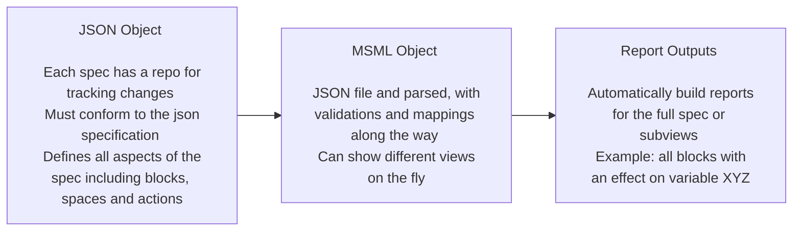

# MSML

## What is the Mathematical Specification Mapping Library (MSML)?

MSML is a library for standardizing the creation of mathematical specifications as JSON objects as well as aiding in the automation of report and visualization creation from these standardized JSON. 

## Why MSML?

Through lived experience of writing specs, it was discovered that the process can be very difficult. It is especially tough when coordinating between groups of stakeholders. For example, if a variable name that is referenced in multiple charts and pieces of the spec is changed, someone needs to go through to both find and revise the name.

As well, there are times when you want a fully zoomed out view, and other times where you want a view on only a specific few pieces of the system. Without MSML, one would have to either duplicate work to show the system in two ways, or decide which way is the better representation. MSML allows for on the fly writing of reports multiple different ways depending on what is important to highlight.

## What are some of the solutions offered?

- **Automation**: Automate writing of a specification
- **Standardization**: Ensure standardization across teams working to spec out a system
- **Flexibility**: Allow for creating views on the fly and in multiple ways depending on what stakeholders find important
- **Trackable**: Keep a repository of a JSON file to track changes to the spec with the same enhancements git provides for projects already

## How does MSML work?

