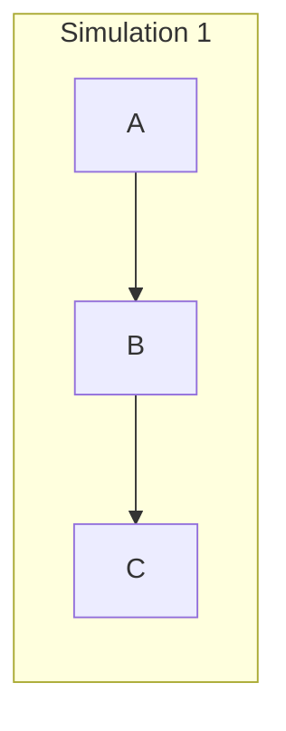
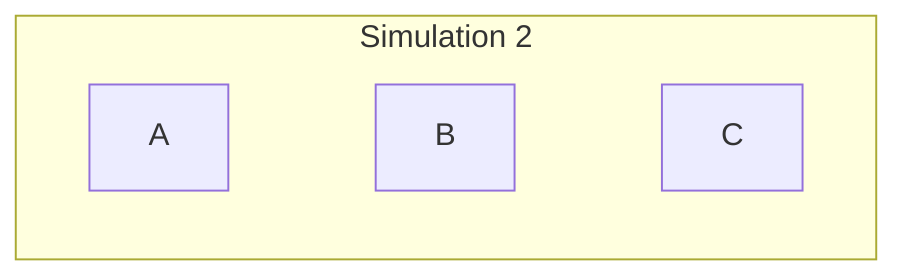
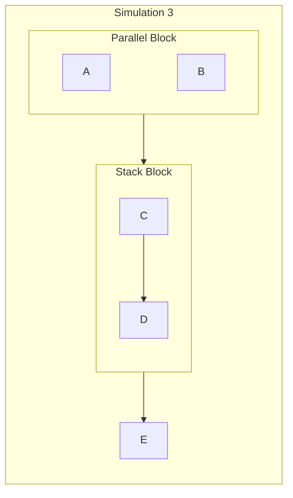

```mermaid
graph TB
subgraph X4[Simulation 1]
direction TB
X1[A]
X2[B]
X3[C]
X1-->X2
X2-->X3
end
```

```mermaid
graph TB
subgraph X4[Simulation 2]
direction LR
X1[A]
X2[B]
X3[C]
X1 ~~~ X2
X2 ~~~ X3
end
```

```mermaid
graph TB
subgraph X8[Simulation 3]
direction TB
subgraph X3[Parallel Block]
direction LR
X1[A]
X2[B]
X1 ~~~ X2
end
subgraph X6[Stack Block]
direction TB
X4[C]
X5[D]
X4-->X5
end
X7[E]
X3-->X6
X6-->X7
end
```