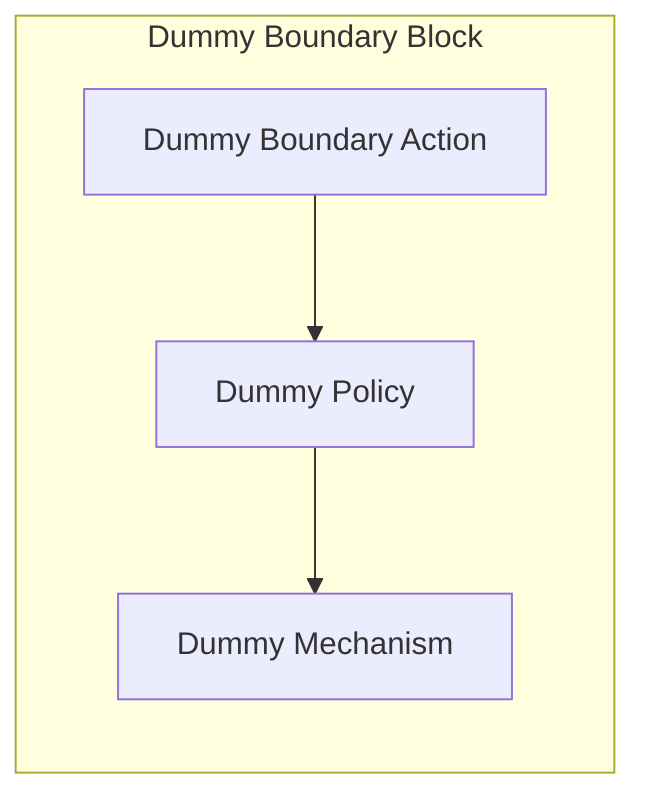
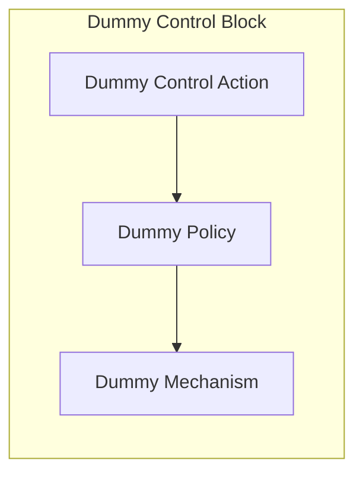

```mermaid
graph TB
subgraph X4[Dummy Boundary Block]
direction TB
X1[Dummy Boundary Action]
X2[Dummy Policy]
X3[Dummy Mechanism]
X1-->X2
X2-->X3
end
```

```mermaid
graph TB
subgraph X4[Dummy Control Block]
direction TB
X1[Dummy Control Action]
X2[Dummy Policy]
X3[Dummy Mechanism]
X1-->X2
X2-->X3
end
```