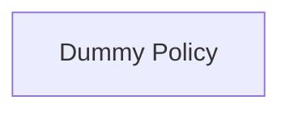
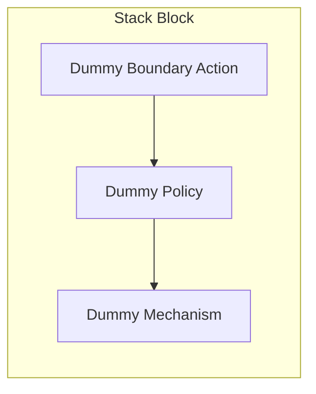
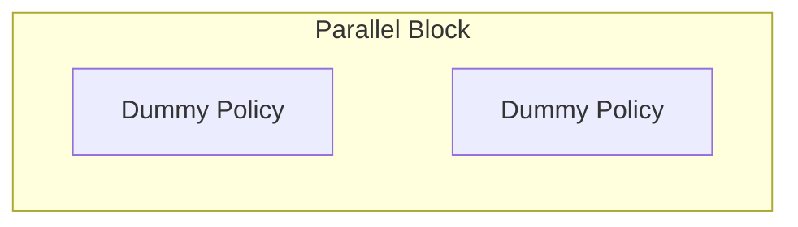
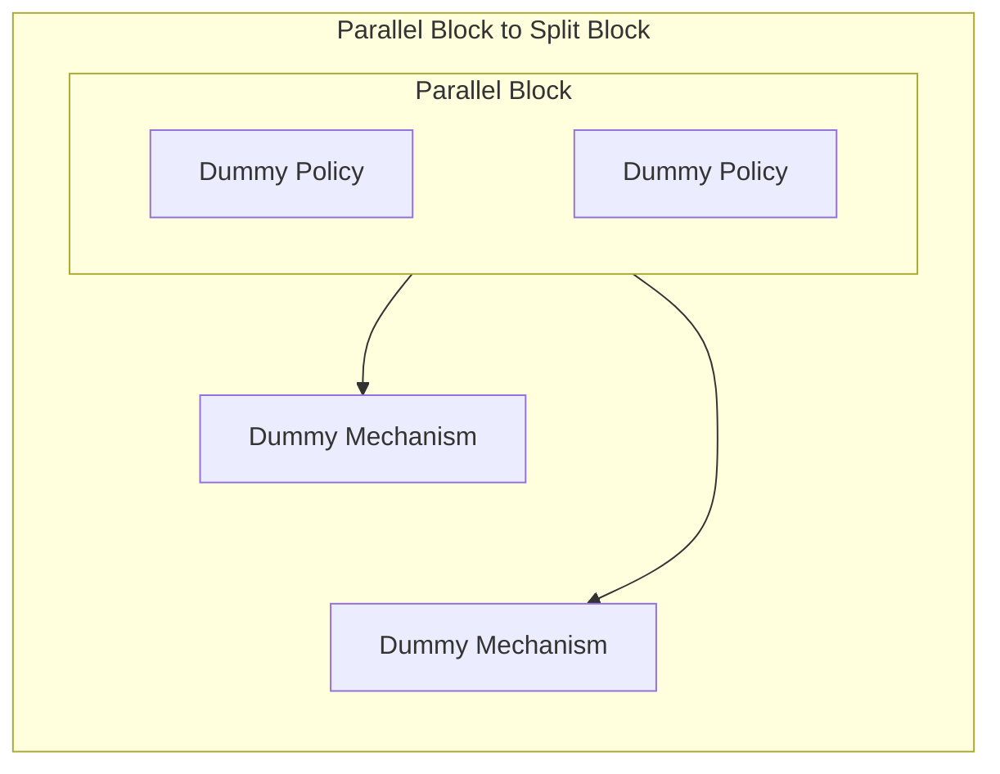

```mermaid
graph TB
X1[Dummy Policy]
```

```mermaid
graph TB
subgraph X4[Stack Block]
direction TB
X1[Dummy Boundary Action]
X2[Dummy Policy]
X3[Dummy Mechanism]
X1-->X2
X2-->X3
end
```

```mermaid
graph TB
subgraph X3[Parallel Block]
direction LR
X1[Dummy Policy]
X2[Dummy Policy]
X1 ~~~ X2
end
```

```mermaid
graph TB
subgraph X6[Parallel Block to Split Block]
direction TB
subgraph X3[Parallel Block]
direction LR
X1[Dummy Policy]
X2[Dummy Policy]
X1 ~~~ X2
end
X4[Dummy Mechanism]
X5[Dummy Mechanism]
X4 ~~~ X5
X3-->X4
X3-->X5
end
```