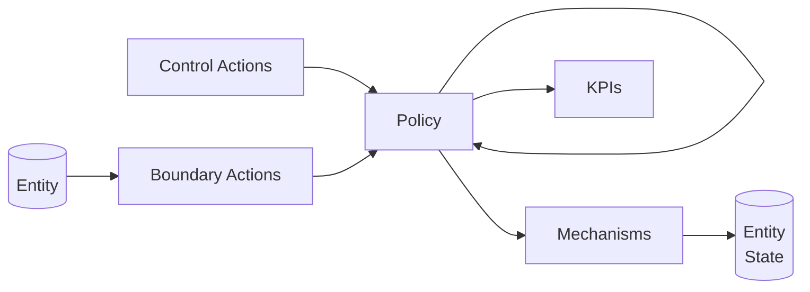

# MSML Enhancements

MSML provides certain enhancements beyond the generalized blocks and spaces that can be utilized when building out specifications.

## Block Enhancements

- All the squares in the following graph are blocks with specialized features. 
- We will use white lines to denote regular transmission channels / wiring, red lines to denote the special case of state update where a mechanism is changing some value of a state variable and blue lines to just show a relationship that suggests a block is called by a class of entities
- This graphic shows all the paths that a block COULD take, not that they will take, one can have a policy which has a kill switch to do nothing or return void

