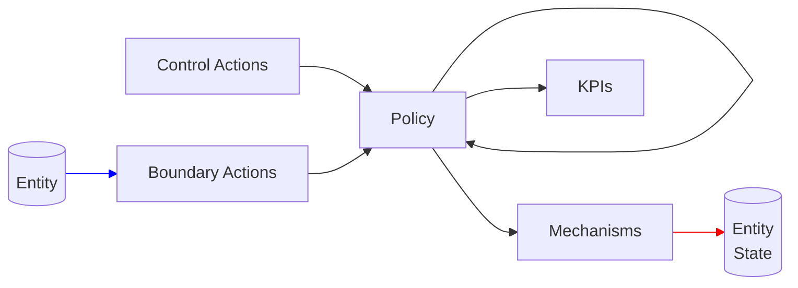

# MSML Enhancements

MSML provides certain enhancements beyond the generalized blocks and spaces that can be utilized when building out specifications.

## Block Enhancements

- All the squares in the following graph are blocks with specialized features. 
- We will use white lines to denote regular transmission channels / wiring, red lines to denote the special case of state update where a mechanism is changing some value of a state variable and blue lines to just show a relationship that suggests a block is called by a class of entities
- This graphic shows all the paths that a block COULD take, not that they will take, one can have a policy which has a kill switch to do nothing or return void

### Control Actions

- Are meant to represent actions in the system not triggered by any specific entity such as time passing or any actions not associated with an entity
- Domain is always none
- Is one block that starts action chains

### Boundary Actions

- Represents specific actions associated with an entity or entities that can call it such as buying an item, joining a group, etc.
- Domain is always none
- Is the other block that starts action chains

### Policy

- Uses both domain and codomain
- Handles all the logic within the specification such as policies for determing the price of an item bought
- Can call other policies or move into calling KPIs or mechanisms

### KPIs

- No codomain and is a terminating block
- Used to keep track of important system KPIs and compute the representation

### Mechanisms

- No codomain and is a terminating block
- Handles all updates to state
- Meant to be a way to standardize variable updates