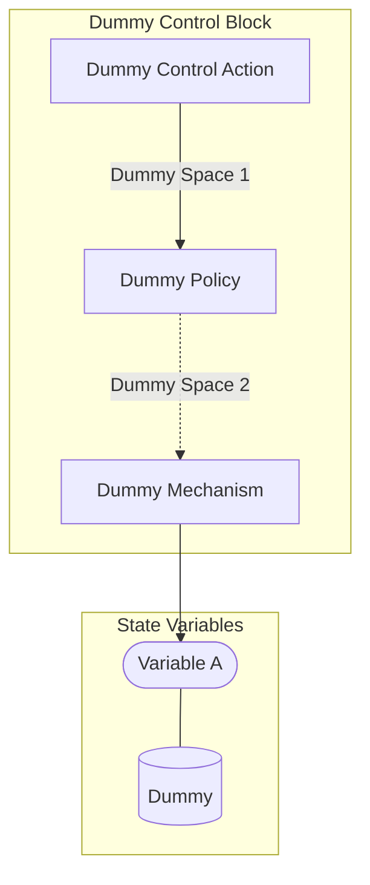

## Wiring Diagram

## Description

Block Type: Stack Block
Dummy Control Block
## Components
1. [[Dummy Control Action]]
2. [[Dummy Policy]]
3. [[Dummy Mechanism]]

## All Blocks
1. [[Dummy Policy]]
2. [[Dummy Control Action]]
3. [[Dummy Mechanism]]

## Constraints

## Domain Spaces

## Codomain Spaces
1. [[Terminating Space]]

## All Spaces Used
1. [[Terminating Space]]
2. [[Dummy Space 2]]
3. [[Dummy Space 1]]

## Parameters Used
1. [[dummy_parameter]]

## Called By

## Calls

## All State Updates
1. [[Dummy]].[[Dummy State-Variable A|Variable A]]

