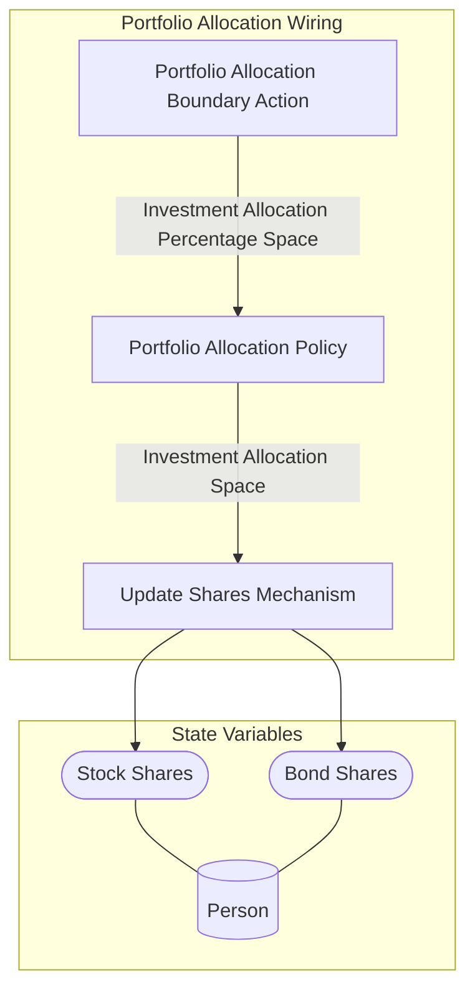

## Wiring Diagram

## Description

Block Type: Stack Block
This wiring takes care of all logic around a person updating their portfolio allocation
## Components
1. [[Portfolio Allocation Boundary Action]]
2. [[Portfolio Allocation Policy]]
3. [[Update Shares Mechanism]]

## All Blocks
1. [[Portfolio Allocation Boundary Action]]
2. [[Update Shares Mechanism]]
3. [[Portfolio Allocation Policy]]

## Constraints

## Domain Spaces

## Codomain Spaces
1. [[Terminating Space]]

## All Spaces Used
1. [[Investment Allocation Percentage Space]]
2. [[Terminating Space]]
3. [[Investment Allocation Space]]

## Parameters Used

## Called By

## Calls

## All State Updates
1. [[Person]].Stock Shares
2. [[Person]].Bond Shares

