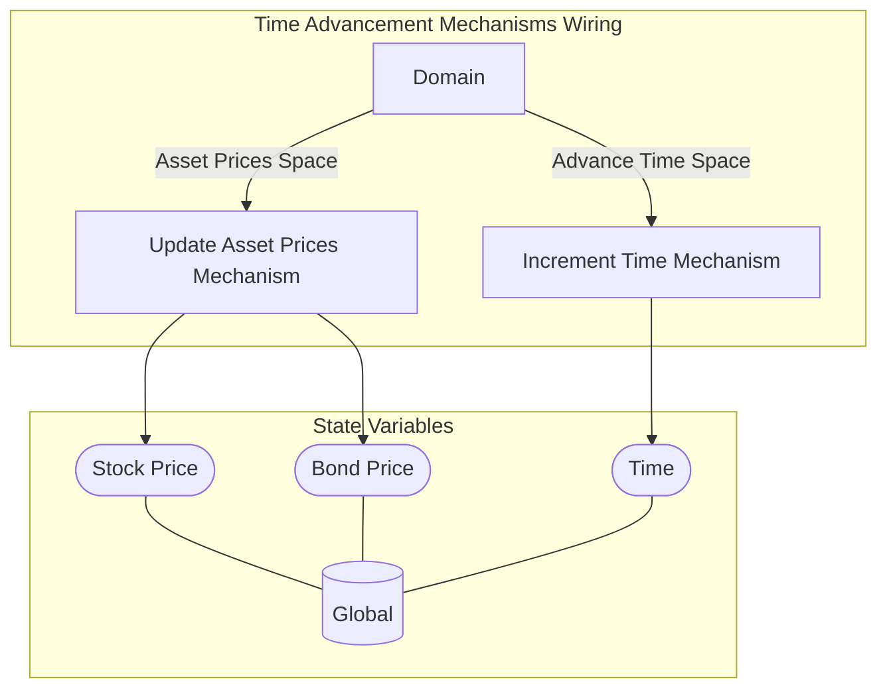

## Wiring Diagram

## Description

Block Type: Parallel Block
This wiring takes care of the mechanisms from the time advancement wiring
## Components
1. [[Update Asset Prices Mechanism]]
2. [[Increment Time Mechanism]]

## All Blocks
1. [[Increment Time Mechanism]]
2. [[Update Asset Prices Mechanism]]

## Constraints

## Domain Spaces
1. [[Asset Prices Space]]
2. [[Advance Time Space]]

## Codomain Spaces
1. [[Empty Space]]

## All Spaces Used
1. [[Empty Space]]
2. [[Asset Prices Space]]
3. [[Advance Time Space]]
4. [[Terminating Space]]

## Parameters Used

## Called By

## Calls

## All State Updates
1. [[Global]].Stock Price
2. [[Global]].Bond Price
3. [[Global]].Time

