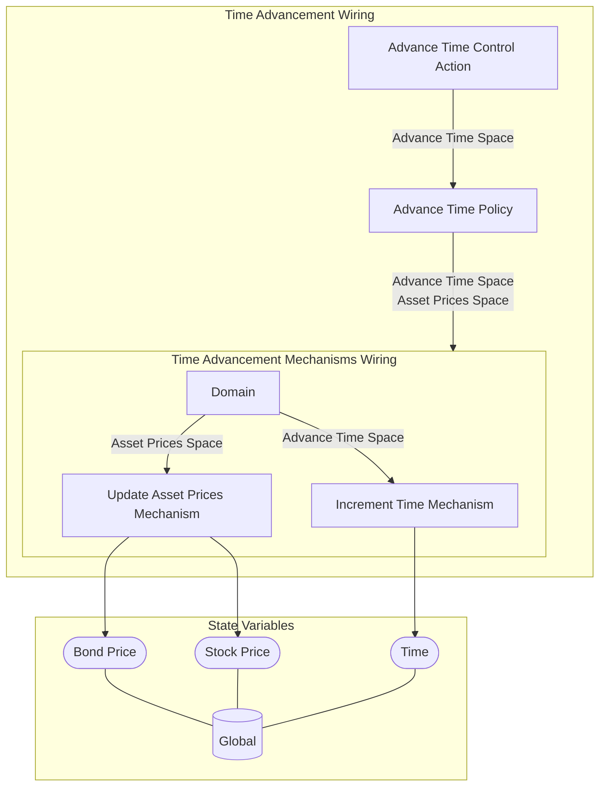

## Wiring Diagram

## Description

Block Type: Stack Block
This wiring takes care of time advancement
## Components
1. [[Advance Time Control Action]]
2. [[Advance Time Policy]]
3. [[Time Advancement Mechanisms Wiring]]

## All Blocks
1. [[Advance Time Policy]]
2. [[Advance Time Control Action]]
3. [[Increment Time Mechanism]]
4. [[Update Asset Prices Mechanism]]

## Constraints

## Domain Spaces

## Codomain Spaces
1. [[Empty Space]]

## All Spaces Used
1. [[Terminating Space]]
2. [[Asset Prices Space]]
3. [[Empty Space]]
4. [[Advance Time Space]]

## Parameters Used
1. [[stock_return_std]]
2. [[bond_return_std]]
3. [[stock_return_mu]]
4. [[bond_return_mu]]

## Called By

## Calls

## All State Updates
1. [[Global]].[[Global State-Bond Price|Bond Price]]
2. [[Global]].[[Global State-Time|Time]]
3. [[Global]].[[Global State-Stock Price|Stock Price]]

