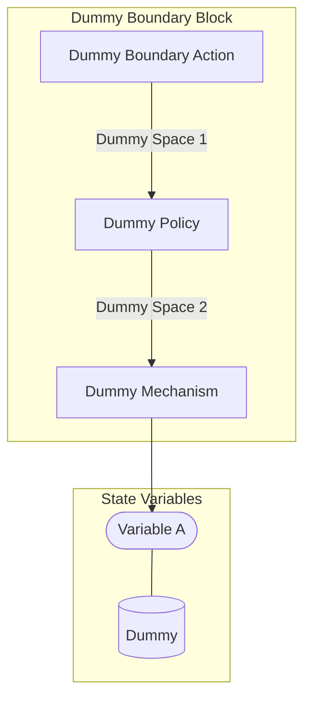

## Wiring Diagram

## State
<h3>Global State</h3><table>
      <tr>
        <th>Name</th>
        <th>Description</th>
        <th>Type</th>
        <th>Symbol</th>
        <th>Domain</th>
      </tr></table><h3>Local States</h3><h4>Dummy State</h4><table>
      <tr>
        <th>Name</th>
        <th>Description</th>
        <th>Type</th>
        <th>Symbol</th>
        <th>Domain</th>
      </tr><tr><td>Variable A</td><td>Variable A</td><td>Dummy Compound Type</td><td></td><td></td></tr><tr><td>Variable B</td><td>Variable B</td><td>Dummy Type 1</td><td></td><td></td></tr><tr><td>Variable C</td><td>Variable C</td><td>Dummy Type 2</td><td></td><td></td></tr></table><h2>Spaces</h2><h3>Terminating Space</h3>
{}
<h3>Dummy Space 2</h3>
{a: Dummy Type 1, b: Dummy Type 1, c: Dummy Type 2}
<h3>Dummy Space 1</h3>
{a: Dummy Type 1}
<h2>Behavioral Action Space</h2><h3>Dummy Boundary Action</h3>
Dummy
<h4>Called By:</h4>

1. Dummy
<h4>Constraints:</h4>
<h4>Boundary Action Options:</h4>

<b>1. V1 Dummy Boundary</b>

Description

Logic: A+B=C

 <h2>Control Action Space</h2><h2>Policies</h2><h3>Dummy Policy</h3>
Dummy Policy
<h4>Preceded By:</h4>

1. Dummy Boundary Action

2. Dummy Control Action
<h4>Domain Spaces:</h4>

1. Dummy Space 1
<h4>Followed By:</h4>

1. Dummy Mechanism

2. Dummy Mechanism
<h4>Codomain Spaces:</h4>

1. Dummy Space 2
<h4>Constraints:</h4>
<h4>Policy Options:</h4>

<b>1. Dummy Policy V1</b>

V1 Dummy Policy

Logic: 
Dummy
Dummy
Dummy

 <h2>Mechanisms</h2><h3>Dummy Mechanism</h3>
Dummy Mechanism
<h4>Preceded By:</h4>

1. Dummy Policy

2. Dummy Policy
<h4>Domain Spaces:</h4>

1. Dummy Space 2
<h4>State Updates:</h4>

1. Dummy.Variable A
<h4>Constraints:</h4>

1. Constaint 1

<h4>Logic:</h4>

Logic for update
<h2>Parameters</h2><h3>dummy_parameter</h3>
Description: 

Symbol: None

Domain: None

Parameter Class: Behavioral
