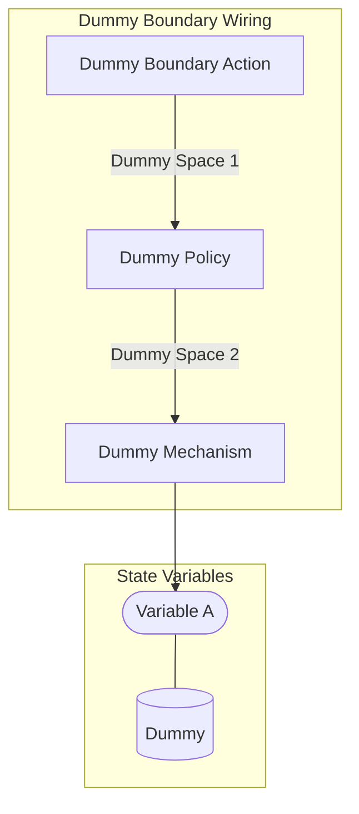
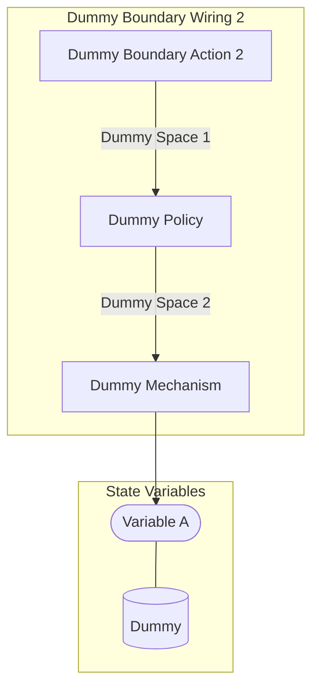
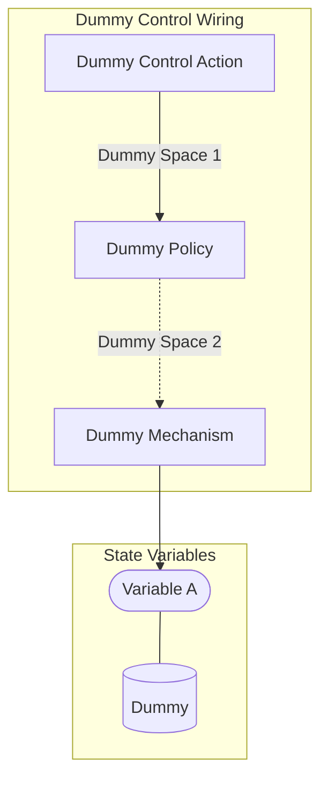

## Wiring Diagrams

## Description

The wirings which are not components of other wirings.
## Wirings
1. [[Dummy Boundary Wiring]]
2. [[Dummy Boundary Wiring 2]]
3. [[Dummy Control Wiring]]

## Unique Components Used
1. [[Dummy Boundary Action]]
2. [[Dummy Boundary Action 2]]
3. [[Dummy Control Action]]
4. [[Dummy Mechanism]]
5. [[Dummy Policy]]

## Unique Parameters Used
1. [[dummy_parameter]]

