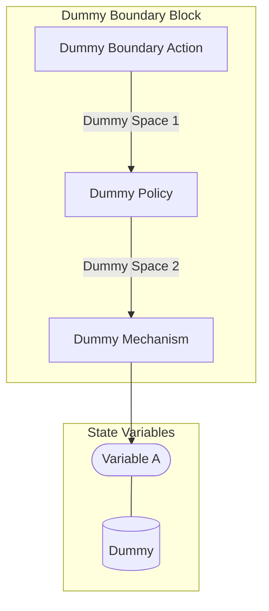

## Wiring Diagrams

## Description

The wirings related to only boundary type actions.
## Wirings
1. [[Dummy Boundary Block]]

## Unique Components Used
1. [[Dummy Boundary Action]]
2. [[Dummy Mechanism]]
3. [[Dummy Policy]]

## Unique Parameters Used
1. [[dummy_parameter]]

