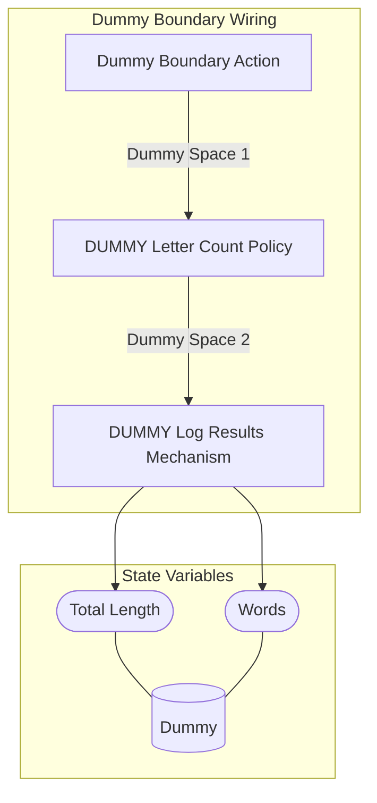
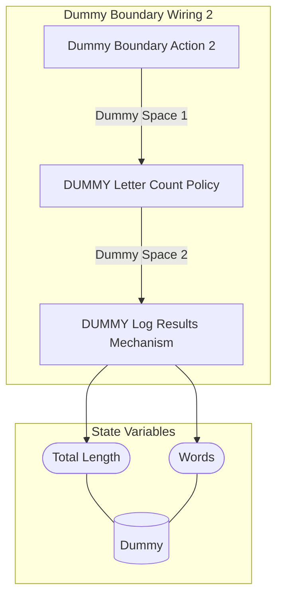

## Wiring Diagrams

## Description

The wirings related to only boundary type actions.
## Wirings
1. [[Dummy Boundary Wiring]]
2. [[Dummy Boundary Wiring 2]]

## Unique Components Used
1. [[DUMMY Letter Count Policy]]
2. [[DUMMY Log Results Mechanism]]
3. [[Dummy Boundary Action]]
4. [[Dummy Boundary Action 2]]

## Unique Parameters Used
1. [[DUMMY Length Multiplier]]

