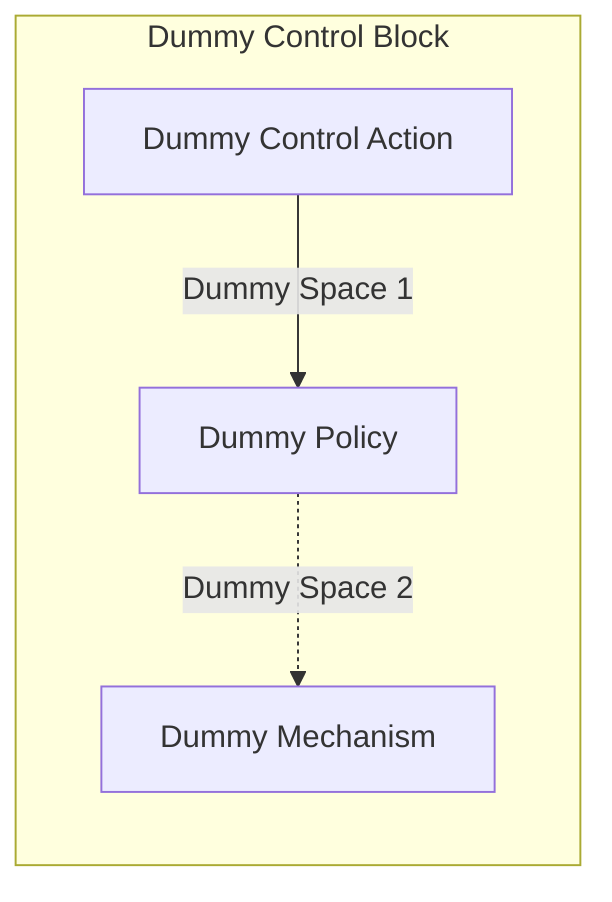

## Wiring Diagram

## Description

Block Type: Stack Block
Dummy Control Block
## Components
1. [[Dummy Control Action]]
2. [[Dummy Policy]]
3. [[Dummy Mechanism]]

## Constraints
## Domain Spaces

## Codomain Spaces
1. [[Terminating Space]]

## Parameters Used
1. [[dummy_parameter]]

## Called By

## Calls

