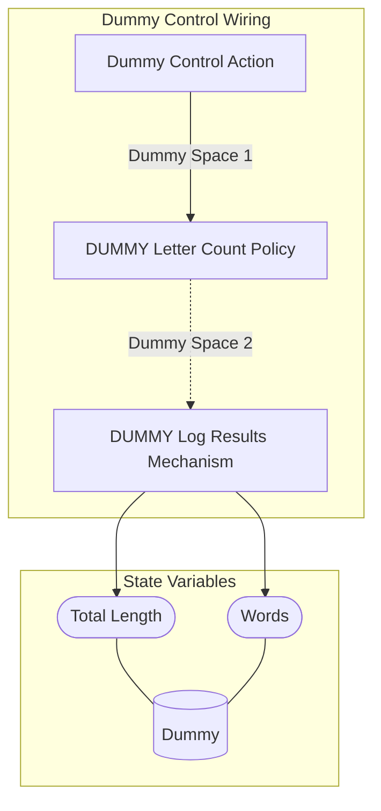

## Wiring Diagram

## Description

Block Type: Stack Block
Dummy Control Block
## Components
1. [[Dummy Control Action]]
2. [[DUMMY Letter Count Policy]]
3. [[DUMMY Log Results Mechanism]]

## All Blocks
1. [[DUMMY Letter Count Policy]]
2. [[DUMMY Log Results Mechanism]]
3. [[Dummy Control Action]]

## Constraints

## Domain Spaces

## Codomain Spaces
1. [[Terminating Space]]

## All Spaces Used
1. [[Dummy Space 1]]
2. [[Dummy Space 2]]
3. [[Terminating Space]]

## Parameters Used
1. [[DUMMY D Probability]]
2. [[DUMMY Length Multiplier]]

## Called By

## Calls

## All State Updates
1. [[Dummy]].[[Dummy State-Total Length|Total Length]]
2. [[Dummy]].[[Dummy State-Words|Words]]

