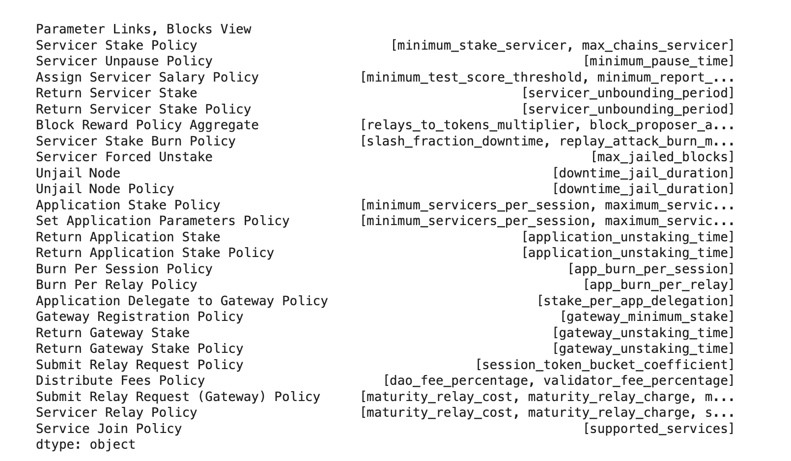

# MSML 12/15/2023 Update (V0.1.0)

## Agenda
1. Review artifacts
2. Update on the latest progress
3. Future research arc
4. Ways to get involved/help
5. [Time Permitting] Working Session on Root Finding Example

## Artifacts

### Github Repositories

There are 4 repositories relevant to MSML:
1. [MSML Repository](https://github.com/BlockScience/MSML): The core repository hosting the library
2. [GDS-cadCAD-MSML Repository](https://github.com/BlockScience/GDS-MSML-cadCAD): The repository hosting some joint shared resources such as canonical examples (WIP) and documentation (WIP)
3. [Root Finding Simulation](https://github.com/SeanMcOwen/Root-Finding-Simulation): A canonical example that I have begun working on that in completion hopefully illustrates how to take a question (which root finding algorithm balances computation time and accuracy) and work through GDS to MSML to cadCAD
4. [Pocket Network Math Spec](https://github.com/BlockScience/PocketMathSpec): A successful example of use of the math spec on a client project to deliver a mathematical specification

### Github Project Plans
1. [V0.2 Project Plan](https://github.com/orgs/BlockScience/projects/21)
2. [V0.3 Project Plan](https://github.com/orgs/BlockScience/projects/22)

### Research Journal

The [MSML research journal](https://hackmd.io/bRrYctLRTAKIiSGChKO8jA) details the monthly output of research efforts

### Slack Communications

There are three channels, ranked in order of relevance, where updates/ideas/etc are shared for MSML:
1. #msml
2. #gds-cadcad-msml
3. #tech-research

### Presentations
1. [Research Retreat 2023 Presentation](https://docs.google.com/presentation/d/1LcUA1VQKfXg3BWwD_r7BkHP_2u-OwsHU_ycOeSS1I7c/edit#slide=id.g25926e95737_0_0)
2. [Econ Research Pod 9/31/2023 Presentation](https://docs.google.com/presentation/d/1h9Dbq9W9acEmRV6Lk_nDYLs0mZd2XAV0i3mga9N0-vw/edit#slide=id.g2798ae5ae3c_0_3)
3. [Tech Research Pod Presentation 12/15/2023](https://hackmd.io/uPNsP70NRcSgpNGxetT7Ww?view)

## Progress Update

The more granular data on issues closed, commits, etc. can be found in the [MSML research journal](https://hackmd.io/bRrYctLRTAKIiSGChKO8jA). The high level updates are:

1. V0.1 of MSML has been launched and uploaded to pypi!
2. Massive progress on report writing aspects of the library, improvements to how the files and reports get automatically generated and also new report types such an entity type
3. New assorted features, for example, there is a new feature that was introduced which maps all parameters in the system and not only what blocks they impact but as well what blocks are impacted in a secondary order because of linkages!

It looks like this, where the result is a dataframe that one could use to ask questions such as (what impacts does tweaking this parameter have): 

There are 4 views available to this that split across an ability to see the grouping by parameters that impact blocks vs. blocks that have associated parameters, and then grouping by first order effects only or second order effects as well.

4. Dogfooding on the Pocket Network project which revealed a huge amount of areas for improvement
5. Dogfooding/canonical example with the introduction of the [Root Finding Simulation](https://github.com/SeanMcOwen/Root-Finding-Simulation)
6. Various run of the mill debugging tasks that don't need to be specifically named but are recorded in the research journal
7. A full wrangling/triaging of github issues into two project plans associated with version launches:
    A. [V0.2 Project Plan](https://github.com/orgs/BlockScience/projects/21)
    B. [V0.3 Project Plan](https://github.com/orgs/BlockScience/projects/22)

## Future Research Arc

### V0.2

- Primarily focused on core development needs such as adding more checking and quality of life improvements
- Major change to the paradigm of action chains to reflect both GDS and DSL wiring / moving to a block-centric approach with policies/mechanisms/contral actions/behavioral actions being semantic sugar
- Assorted other issues categorized as high priority
- Completion of the V1 of the root finding canonical example
- Triage of issues:
    - 5 really easy ones done last week
    - 4 are in progress
    - 8 in queue 1
    - 10 in queue 2
    - 15 in queue 3

### V0.3
- 20 uncategorized issues
- Assorted feature improvement
- Assorted low priority updates and quality of life additions
- Moving towards implementation of usage of DSL style cadCAD blocks and primitives to prepare for V0.4 
- Update to the root finding canonical example

### V0.4+
- Integration with cadCAD more closely so that there is a bi-directional ability to scaffold cadCAD models + update MSML from the latest versions of a cadCAD model
- More canonical examples
- Testing
- More quality of life improvements and changes

## Ways to get involved/help

### Canonical Example Feedback

- Primarily need someone with GDS knowledge to do a working session and deliver feedback

### Dogfooding

- Other client math spec dogfooding
- Other toy example dogfooding of MSML
- Other canonical examples with integrations to GDS and cadCAD

### cadCAD + GDS Integration

- Later on will want to more working sessions with each respective group
- Improve documentation to [GDS-cadCAD-MSML Repository](https://github.com/BlockScience/GDS-MSML-cadCAD): The repository hosting some joint shared resources such as canonical examples (WIP) and documentation (WIP)
- Along on the lexicon we use for things and any other important alignments

## Time Permitting Working Session

[Root Finding Simulation](https://github.com/SeanMcOwen/Root-Finding-Simulation)
