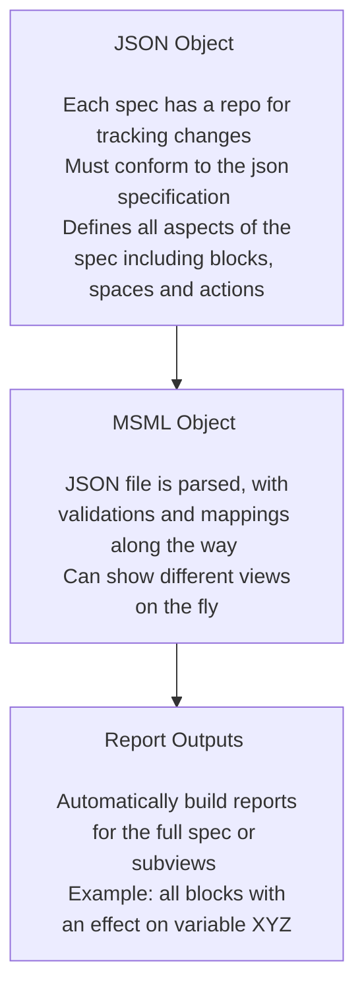

# Executive Summary

This research note shows how to start building out a first mathematical specification with the MSML library. This research note will walk through a guide example with the following format:

1. Introduce the MSML
2. Introduce the Problem Statement
3. Iteratively Explain Components with Worked Examples

## What is the Mathematical Specification Mapping Library (MSML)?

MSML is a library for standardizing the creation of mathematical specifications as JSON objects as well as aiding in the automation of report and visualization creation from these standardized JSON. 

It uses block diagram wirings and spaces to represent the actions in complex systems in line with current BlockScience research on Generalized Dynamical Systems. It also adds some enhancements to the primitive blocks to represent richer sets of behaviors.

One good example is the [wiring report](https://github.com/SeanMcOwen/Root-Finding-Simulation/blob/main/MSML/reports/Simulation%20Block.md) for the Root Finding Simulation canonical example.

### Installing the library

To install the library, simply pip install by running "pip install math_spec_mapping"

### Why MSML?

Writing mathematical specifications can be a difficult process, especially when variable names are changed or new mechanisms are introduced. MSML seeks to streamline the process with automations as well as enhance the abilities of static math specs to deliver deeper insights. Because it is automated, one can write specifications at different levels of details or for different purposes.

### What are some of the solutions offered?

- **Automation**: Automate writing of a specification
- **Standardization**: Ensure standardization across teams working to spec out a system
- **Flexibility**: Allow for creating views on the fly and in multiple ways depending on what stakeholders find important
- **Trackability**: Keep a repository of a JSON file to track changes to the spec with the same enhancements git provides for projects already

### How does MSML work?

## Problem Statement

For this guided example, the following is the problem statement from which we will build the specification.

Investing for retirement is often modeled with monte carlo simulations because of how much path dependence there is. The following are the specific facts of the problem:
- There is only one person of interest in the model, the employee looking to retire.
- They only have control over the allocation percentages at any given time between bonds and stocks.
- Any time a trade is conducted, a commission fee of 30 basis points (.30%) will be taken out on both sell orders and buy orders.
- The returns of both stocks and bonds are assumed to be randomly distributed (although this could of course be extended to get more accurate measures), and can be parameterized by $\mu_s$, $\sigma_s$, $\mu_b$ and $\sigma_b$.

## Getting Started with a Base Directory

- We can begin by forking the [starter repo](https://github.com/BlockScience/MSML/tree/main/examples/StarterRepo) into a directory and removing the "model" folder since we are just doing a spec today.
- We will also clear out the reports folder to start fresh.

### The Initialization File

- The \_\_init\_\_.py is the entrypoint for all of components of our spec. You will note that in the example set up, each folder brings in a set of components to the spec json.

### Component Definitions

- If we dive deeper into the repository, we see that there are component definitions in the folders which just requires that there is a list with all components to be added.
- The following is what the policy definitions look like for the dummy repo in terms of the \_\_init\_\_.py file as well as the specific definitions (more on definition specifics later).

### Test Run on Functionality

- Before we begin to make any changes, we need to first make sure functionality works. We will take the "Build Starter Repo.ipynb" notebook and use it to make sure.
- We will update the code to be:
<pre><code>"""# For the production library
from math_spec_mapping import (load_from_json, write_all_markdown_reports, write_spec_tree)"""

# Development library loading
import sys
sys.path.append("/Users/seanmcowen/Dropbox/BlockScience")
from MSML.src.math_spec_mapping import (load_from_json, write_all_markdown_reports, write_spec_tree)

from src import math_spec_json
from copy import deepcopy
ms = load_from_json(deepcopy(math_spec_json))

d = "reports/Markdown"
write_all_markdown_reports(ms, d, clear_folders=True)
write_spec_tree(ms, path=d, linking=True)</code></pre>
- If using the development library make sure to update the path to the MSML folder
- Make sure the you create the Markdown folder in the reports folder
- The notebook will look like this and be able to be run:

- The markdown folder can now be opened up in Obsidian and should look like the following:

### Updating the Spec

- We now are going to move into updating the spec, which we will do iteratively while going through each component and what it means
- The dummy components will be taken out at the very end because they can be very helpful for understanding how the format works

## Types

### Definitions

**Types**: This is for defining what a type might in its most basic form. These could be single typings or compound typings. The point here is to allow for changing typing in one single place and having it flow through anywhere else. I.e. if one were to define the currency type as USD, but then the project switched to using EUR, it would just require changing currency to be EUR.

### JSON Spec

The schema is defined [here](../docs/JSON-Specification/schema-definitions-type.md)

### Adding our First Types

- The first types we can infer from reading the problem statement is that we are going to have a USD type to denote dollar amounts, as well as two types for number of shares in bonds and number of shares in stocks. 
- What we want to do is create a file called "Investments.py" in the types folder which we will use to host these three new types.
- For now we will ignore what the "type" as it will be covered how MSML maps types into different programming languages in a later section.
- The following type definitions can be written into the python file to give us our first three types:

<pre><code>USDType = {"name": "USD Type", "type": "USDType", "notes": "A dollar amount"}
StockSharesType = {
    "name": "Stock Shares Type",
    "type": "StockSharesType",
    "notes": "The number of shares of stock. Note that in this current spec, it is assumed that fractional shares can be held.",
}
BondSharesType = {
    "name": "Bond Shares Type",
    "type": "BondSharesType",
    "notes": "The number of shares of bonds. Note that in this current spec, it is assumed that fractional shares can be held.",
}</code></pre>

- And the \_\_init\_\_.py file can be updated to be:

<pre><code>from .Dummy import DummyCompoundType, DummyType1, DummyType2
from .Investments import USDType, BondSharesType, StockSharesType

types = [
    DummyType1,
    DummyType2,
    DummyCompoundType,
    USDType,
    BondSharesType,
    StockSharesType,
]</code></pre>

## Entities & State

### Definitions

- **Entity**: Entities are any class of user or infrastructure that should have their own state and potentially ability to call boundary actions. Examples could be a customer or a company (for which a simulation might assume it is acting as one cohesive unit)
- **State**: The definition of states in the system. There is one global system state and then the rest of the definitions are local states, generally for recording what entity states there are.

### JSON Spec

The specific schemas for entities and states are defined here:

- [Entity](../docs/JSON-Specification/schema-definitions-entity.md)
- [State](../docs/JSON-Specification/schema-definitions-state.md)

### Adding Entity & State

- Our first starting point will be to define out what entities we have in our system.
- We have the global entity which we will not touch yet but represents the global system and has the associated global state
- Besides the global state, we can see from the proble statement that there should be a Person entity representing the person who is saving for retirement.

Add person to global state
Add in person entity
Add in person state