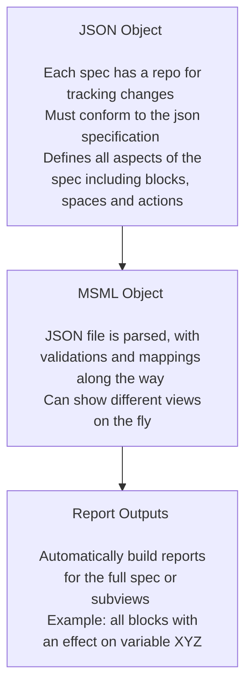
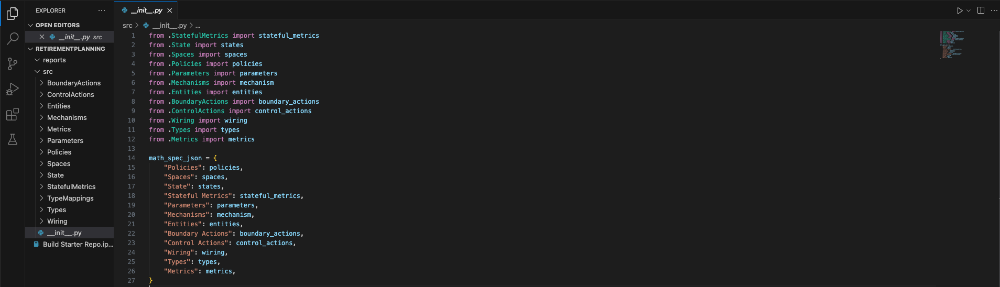
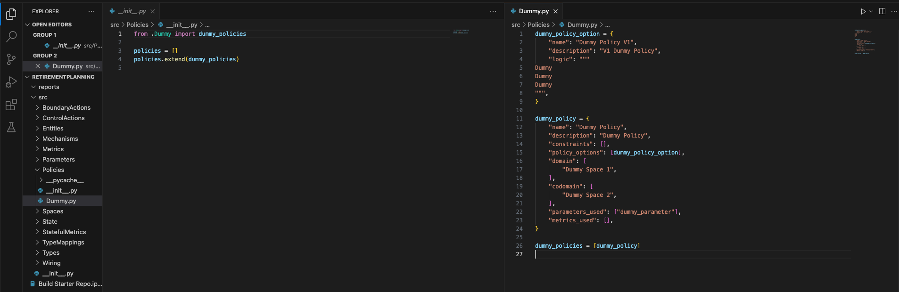
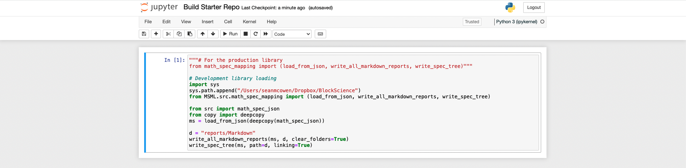
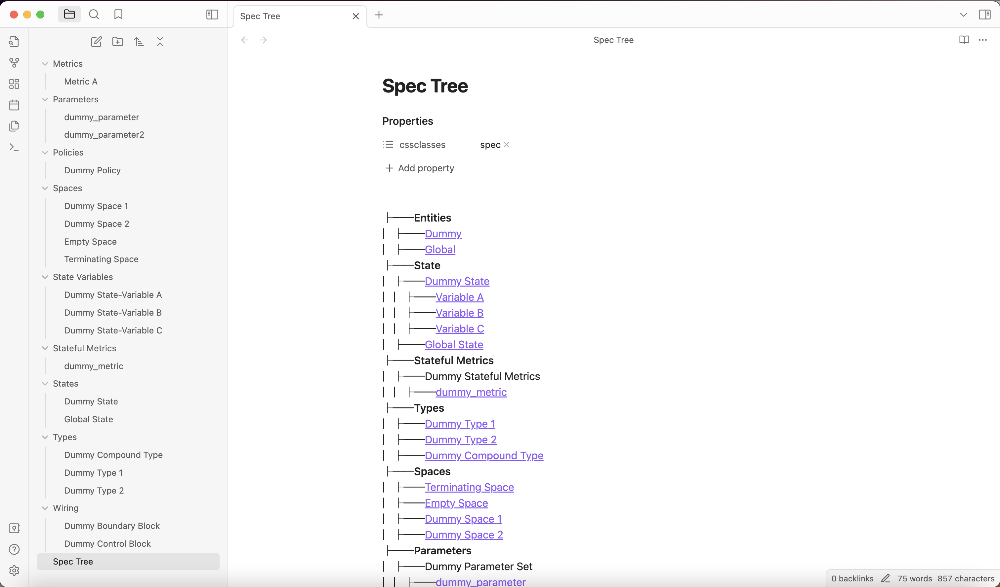
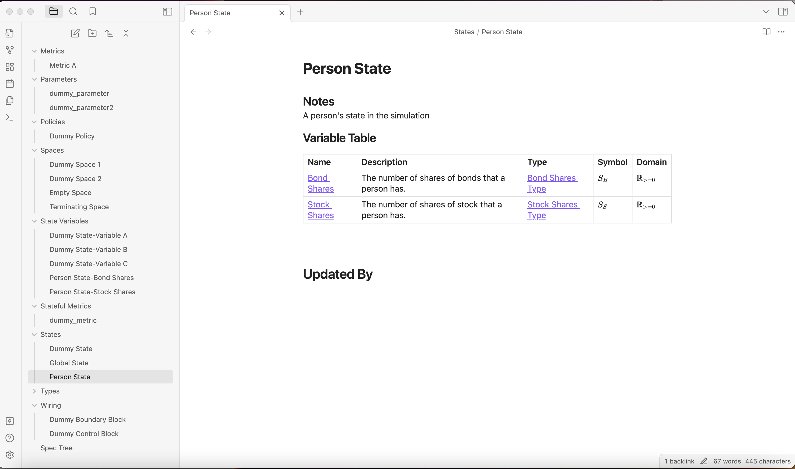

# Executive Summary

This research note shows how to start building out a first mathematical specification with the MSML library. This research note will walk through a guide example with the following format:

1. Introduce the MSML
2. Introduce the Problem Statement
3. Iteratively Explain Components with Worked Examples

## What is the Mathematical Specification Mapping Library (MSML)?

MSML is a library for standardizing the creation of mathematical specifications as JSON objects as well as aiding in the automation of report and visualization creation from these standardized JSON. 

It uses block diagram wirings and spaces to represent the actions in complex systems in line with current BlockScience research on Generalized Dynamical Systems. It also adds some enhancements to the primitive blocks to represent richer sets of behaviors.

One good example is the [wiring report](https://github.com/SeanMcOwen/Root-Finding-Simulation/blob/main/MSML/reports/Simulation%20Block.md) for the Root Finding Simulation canonical example.

### Installing the library

To install the library, simply pip install by running "pip install math_spec_mapping"

### Why MSML?

Writing mathematical specifications can be a difficult process, especially when variable names are changed or new mechanisms are introduced. MSML seeks to streamline the process with automations as well as enhance the abilities of static math specs to deliver deeper insights. Because it is automated, one can write specifications at different levels of details or for different purposes.

### What are some of the solutions offered?

- **Automation**: Automate writing of a specification
- **Standardization**: Ensure standardization across teams working to spec out a system
- **Flexibility**: Allow for creating views on the fly and in multiple ways depending on what stakeholders find important
- **Trackability**: Keep a repository of a JSON file to track changes to the spec with the same enhancements git provides for projects already

### How does MSML work?

### Generalized Dynamical Systems Basics

For more information with regards to the GDS fundamentals, one can look at this [repository](https://github.com/BlockScience/GDS-MSML-cadCAD). Below is abbreviated documentation describing the fundamentals of Generalized Dynamical Systems (GDS).

#### Blocks

A Block is a parameterized operation that, for each Point in its Parameters Space, maps a Point in an input Space to a unique point in an output Space.	

Basic blocks are characterized by three things:

**Domain**: The space(s) that are taken in for the function

**Codomain**: The space(s) that are emitted out from the function

**Logic**: The logic that describes the transformation from domain to codomain

#### Spaces

A space is a pointer to a collection of dimensions.	For example we might have a space such as cartesian coordinates with the schema {"x": float, "y": float}. Spaces are passed between domains and codomains of blocks.

#### Wiring

A wiring is a block composed of other blocks with specific behaviors or orders of execution. For instance, there can be wirings that have blocks run one after another, passing their codomains to the next block's domain. There can also be wirings for blocks that all should run in parallel.

### MSML Components

MSML extends GDS with multiple types of blocks and other enhancements. Below are the definitions of top level components.

#### Types & Spaces

- **Type**: This is for defining what a type might in its most basic form. These could be single typings or compound typings. The point here is to allow for changing typing in one single place and having it flow through anywhere else. I.e. if one were to define the currency type as USD, but then the project switched to using EUR, it would just require changing currency to be EUR.
- **Space**: Spaces are similar to types in that they define a schema for data and are used as the domain/codomain for different blocks. They can be thought of as typed dictionaries.

#### Entities, States, Parameters & Metrics

- **Entity**: Entities are any class of user or infrastructure that should have their own state and potentially ability to call boundary actions. Examples could be a customer or a company (for which a simulation might assume it is acting as one cohesive unit)
- **State**: The definition of states in the system. There is one global system state and then the rest of the definitions are local states, generally for recording what entity states there are.
- **Stateful Metric**: Variables that are not held directly in the state but can computed from the state & parameters.
- **Parameter**: Both local and global parameter sets in the system that could be set
- **Metric**: This component takes a variety of potential inputs and creates a metric from it. This can be used for defining out system success metrics or trying to modularize certain calculations that are needed across many other system components.

#### Blocks & Wiring

- **Boundary Action**: The definition of different actions that might happen outside of the system such as customers coming into a shop. Generally will be called by entities.
- **Control Action**: The definition of actions that the system might call, such as an action to refill the stock of an item when reserves run too low or something that could get triggered from a sensor. The key differentiator from boundary actions is that there is no entity calling it and it is not done with randomness.
- **Policy**: A definition of the policies that handle all logical things. This could be, for example, a policy which determines what price is paid given a boundary action of someone putting in a market buy order for a stock.
- **Mechanism**: Anything that updates state in the system, usually policies will call these with the outputs of logic. The reasoning to split them out is so that if at some point you want to add a recording variable every time an account is changed or do something like have a variable listener, you can just change the mechanism responsible for it in only one place.
- **Wiring**: A wiring is a block composed of other blocks with specific behaviors or orders of execution. For instance, there can be wirings that have blocks run one after another, passing their codomains to the next block's domain. There can also be wirings for blocks that all should run in parallel.

## Problem Statement

For this guided example, the following is the problem statement from which we will build the specification.

Investing for retirement is often modeled with monte carlo simulations because of how much path dependence there is. The following are the specific facts of the problem:
- There is only one person of interest in the model, the employee looking to retire.
- They only have control over the allocation percentages at any given time between bonds and stocks.
- Any time a trade is conducted, a commission fee of 30 basis points (.30%) will be taken out on both sell orders and buy orders.
- The returns of both stocks and bonds are assumed to be randomly distributed (although this could of course be extended to get more accurate measures), and can be parameterized by $\mu_s$, $\sigma_s$, $\mu_b$ and $\sigma_b$.
- The person rebalancing their portfolio rebalances it to a percentage of stocks and a percentage of bonds. This percentage will over time change, however, based on how the prices of the assets change!

## Getting Started with a Base Directory

- We can begin by forking the [starter repo](https://github.com/BlockScience/MSML/tree/main/examples/StarterRepo) into a directory and removing the "model" folder since we are just doing a spec today.
- We will also clear out the reports folder to start fresh.

### The Initialization File

- The \_\_init\_\_.py is the entrypoint for all of components of our spec. You will note that in the example set up, each folder brings in a set of components to the spec json.

### Component Definitions

- If we dive deeper into the repository, we see that there are component definitions in the folders which just requires that there is a list with all components to be added.
- The following is what the policy definitions look like for the dummy repo in terms of the \_\_init\_\_.py file as well as the specific definitions (more on definition specifics later).

### Test Run on Functionality

- Before we begin to make any changes, we need to first make sure functionality works. We will take the "Build Starter Repo.ipynb" notebook and use it to make sure.
- We will update the code to be:
<pre><code>"""# For the production library
from math_spec_mapping import (load_from_json, write_all_markdown_reports, write_spec_tree)"""

# Development library loading
import sys
sys.path.append("/Users/seanmcowen/Dropbox/BlockScience")
from MSML.src.math_spec_mapping import (load_from_json, write_all_markdown_reports, write_spec_tree)

from src import math_spec_json
from copy import deepcopy
ms = load_from_json(deepcopy(math_spec_json))

d = "reports/Markdown"
write_all_markdown_reports(ms, d, clear_folders=True)
write_spec_tree(ms, path=d, linking=True)</code></pre>
- If using the development library make sure to update the path to the MSML folder
- Make sure the you create the Markdown folder in the reports folder
- The notebook will look like this and be able to be run:

- The markdown folder can now be opened up in Obsidian and should look like the following:

### Updating the Spec

- We now are going to move into updating the spec, which we will do iteratively while going through each component and what it means
- The dummy components will be taken out at the very end because they can be very helpful for understanding how the format works

## Types

### Definitions

**Types**: This is for defining what a type might in its most basic form. These could be single typings or compound typings. The point here is to allow for changing typing in one single place and having it flow through anywhere else. I.e. if one were to define the currency type as USD, but then the project switched to using EUR, it would just require changing currency to be EUR.

### JSON Spec

The schema is defined [here](../docs/JSON-Specification/schema-definitions-type.md)

### Adding our First Types

- The first types we can infer from reading the problem statement is that we are going to have a USD type to denote dollar amounts, as well as two types for number of shares in bonds and number of shares in stocks. 
- What we want to do is create a file called "Investments.py" in the types folder which we will use to host these three new types.
- For now we will ignore what the "type" as it will be covered how MSML maps types into different programming languages in a later section.
- The following type definitions can be written into the python file to give us our first three types:

<pre><code>USDType = {"name": "USD Type", "type": "USDType", "notes": "A dollar amount"}
StockSharesType = {
    "name": "Stock Shares Type",
    "type": "StockSharesType",
    "notes": "The number of shares of stock. Note that in this current spec, it is assumed that fractional shares can be held.",
}
BondSharesType = {
    "name": "Bond Shares Type",
    "type": "BondSharesType",
    "notes": "The number of shares of bonds. Note that in this current spec, it is assumed that fractional shares can be held.",
}</code></pre>

- And the \_\_init\_\_.py file can be updated to be:

<pre><code>from .Dummy import DummyCompoundType, DummyType1, DummyType2
from .Investments import USDType, BondSharesType, StockSharesType

types = [
    DummyType1,
    DummyType2,
    DummyCompoundType,
    USDType,
    BondSharesType,
    StockSharesType,
]</code></pre>

## Entities & State

### Definitions

- **Entity**: Entities are any class of user or infrastructure that should have their own state and potentially ability to call boundary actions. Examples could be a customer or a company (for which a simulation might assume it is acting as one cohesive unit)
- **State**: The definition of states in the system. There is one global system state and then the rest of the definitions are local states, generally for recording what entity states there are.

### JSON Spec

The specific schemas for entities and states are defined here:

- [Entity](../docs/JSON-Specification/schema-definitions-entity.md)
- [State](../docs/JSON-Specification/schema-definitions-state.md)

### Adding Entity & State

- Our first starting point will be to define out what entities we have in our system.
- We have the global entity which we will not modify right now but represents the global system and has the associated global state
- Besides the global state, we can see from the problem statement that there should be a Person entity representing the person who is saving for retirement.
- To add the person entity, we define out the following in a new file we will name "Person.py" in the Entities folder.
<pre><code>person_entity = {
    "name": "Person",
    "notes": "A person who is trying to save up for retirement in the simulation.",
    "state": "Person State",
}</code></pre>
- Then modify the \_\_init\_\_.py in the entities folder like so:

<pre><code>from .Dummy import dummy_entity
from .Global import global_entity
from .Person import person_entity

entities = [dummy_entity, global_entity, person_entity]</code></pre>
- This could would fail if we ran it right away because it is missing the "Person State" referenced.
- We create the "Person.py" file in the State folder to define out our state for the person as follows below:
<pre><code>person_state = {
    "name": "Person State",
    "notes": "A person's state in the simulation",
    "variables": [
        {
            "type": "Bond Shares Type",
            "name": "Bond Shares",
            "description": "The number of shares of bonds that a person has.",
            "symbol": "$S_{B}$",
            "domain": "$\mathbb{R}_{>=0}$",
        },
        {
            "type": "Stock Shares Type",
            "name": "Stock Shares",
            "description": "The number of shares of stock that a person has.",
            "symbol": "$S_{S}$",
            "domain": "$\mathbb{R}_{>=0}$",
        },
    ],
}</code></pre>
- The \_\_init\_\_.py also gets updated but we will no longer show the code updates since they are relatively straightforward imports.
- You will notice that for the domain and symbol latex is used. This gets rendered nicely in markdown and can be seen below.

## Boundary Action & First Space

- We have defined out some very basic pieces of the spec, and now we can begin to think through the problem statement and what it would mean for a person to change their allocation.
- The first thing to think about in regards to this boundary action, is what space should be coming out of it.
    - We know that the investment allocation is supposed to be in terms of percentage of stocks vs. bonds, so we want to define our space out like that.
    - We can think of the spaces as having a component for each (technically only one is needed, and 1 - that value equals the other, but we will show it with both and using constraints to ensure they add up to 100%)
- Before we can write the space out, we need to define how we show the percentages. Some people might prefer to use a percentage, i.e. 60% or 60 corresponds to 60%, while others may prefer to use decimals, i.e. .60 means 60%. We will add a new type called "Decimal Type" to denote that we are using decimals in this simulation.
- The following is added to the "Investments.py" file in the Types folder:
<pre><code>DecimalType = {
    "name": "Decimal Type",
    "type": "DecimalType",
    "notes": "The type which denotes a percentage as a decimal, i.e. .60 means 60%.",
}</code></pre>
- Now that we have defined out this new type that we needed to add, we move on to the spaces and boundary actions.

### Definitions

- **Space**: Spaces are similar to types in that they define a schema for data and are used as the domain/codomain for different blocks. They can be thought of as typed dictionaries.
- **Boundary Action**: The definition of different actions that might happen outside of the system such as customers coming into a shop. Generally will be called by entities.

### JSON Spec

The specific schemas for entities and states are defined here:

- [Space](../docs/JSON-Specification/schema-definitions-space.md)
- [Boundary Action](../docs/JSON-Specification/schema-definitions-boundary-action.md)

### Adding the Percentage Allocation Space
- Our first space will be called the percentage allocation space and will be used to denote the space that our boundary action will output.
- We add "Investments.py" to the Spaces folder and the following defines out what our space should look like:
<pre><code>investment_allocation_space = {
    "name": "Investment Allocation Space",
    "schema": {
        "percentage_bonds": "Decimal Type",
        "percentage_stocks": "Decimal Type",
    },
}

investment_spaces = [investment_allocation_space]</code></pre>
- Notice the schema defines out the two variables that are part of the space which are meant to denote the allocation choices of the person.

- The following code defines out, in "Investment.py" within the BoundaryActions folder, what the boundary action should be.
<pre><code></code></pre>

- Constraint of allocations == 1