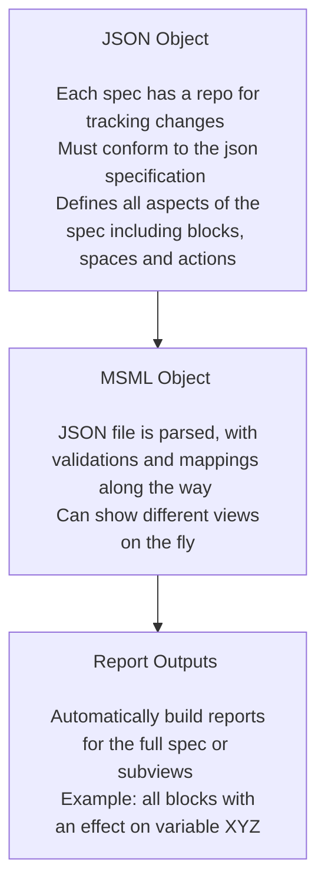

# Executive Summary

This research note shows how to start building out a first mathematical specification with the MSML library. This research note will walk through a guide example with the following format:

1. Introduce the MSML
2. Introduce the Problem Statement
3. Iteratively Explain Components with Worked Examples

## What is the Mathematical Specification Mapping Library (MSML)?

MSML is a library for standardizing the creation of mathematical specifications as JSON objects as well as aiding in the automation of report and visualization creation from these standardized JSON. 

It uses block diagram wirings and spaces to represent the actions in complex systems in line with current BlockScience research on Generalized Dynamical Systems. It also adds some enhancements to the primitive blocks to represent richer sets of behaviors.

One good example is the [wiring report](https://github.com/SeanMcOwen/Root-Finding-Simulation/blob/main/MSML/reports/Simulation%20Block.md) for the Root Finding Simulation canonical example.

### Installing the library

To install the library, simply pip install by running "pip install math_spec_mapping"

### Why MSML?

Writing mathematical specifications can be a difficult process, especially when variable names are changed or new mechanisms are introduced. MSML seeks to streamline the process with automations as well as enhance the abilities of static math specs to deliver deeper insights. Because it is automated, one can write specifications at different levels of details or for different purposes.

### What are some of the solutions offered?

- **Automation**: Automate writing of a specification
- **Standardization**: Ensure standardization across teams working to spec out a system
- **Flexibility**: Allow for creating views on the fly and in multiple ways depending on what stakeholders find important
- **Trackability**: Keep a repository of a JSON file to track changes to the spec with the same enhancements git provides for projects already

### How does MSML work?

## Problem Statement

For this guided example, the following is the problem statement from which we will build the specification.

Investing for retirement is often modeled with monte carlo simulations because of how much path dependence there is. The following are the specific facts of the problem:
- There is only one person of interest in the model, the employee looking to retire.
- They only have control over the allocation percentages at any given time between bonds and stocks.
- Any time a trade is conducted, a commission fee of 30 basis points (.30%) will be taken out on both sell orders and buy orders.
- The returns of both stocks and bonds are assumed to be randomly distributed (although this could of course be extended to get more accurate measures), and can be parameterized by $\mu_s$, $\sigma_s$, $\mu_b$ and $\sigma_b$.

## Getting Started with a Base Directory

- We can begin by forking the [starter repo](https://github.com/BlockScience/MSML/tree/main/examples/StarterRepo) into a directory and removing the "model" folder since we are just doing a spec today.
- We will also clear out the reports folder to start fresh.

### The Initialization File

- The \_\_init\_\_.py is the entrypoint for all of components of our spec. You will note that in the example set up, each folder brings in a set of components to the spec json.

### Component Definitions

- If we dive deeper into the repository, we see that there are component definitions in the folders which just requires that there is a list with all components to be added.
- The following is what the policy definitions look like for the dummy repo in terms of the \_\_init\_\_.py file as well as the specific definitions (more on definition specifics later).

### Test Run on Functionality

- Before we begin to make any changes, we need to first make sure functionality works. We will take the "Build Starter Repo.ipynb" notebook and use it to make sure.
- Everything after the write_spec_tree can be deleted as we will not go through metaprogramming or more advanced reporting.