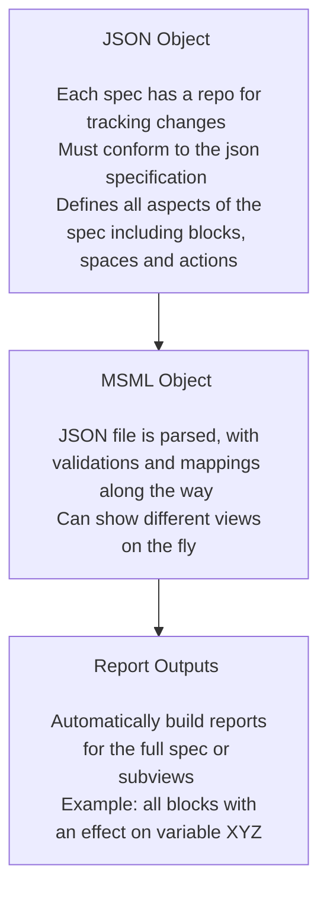

# Annual Presentation

Presented during BlockScience Town Hall on 6/26/2024
Author: Sean McOwen

## Executive Summary

## The Evolving Objectives of the Mathematical Specification Mapping Library Project

### Prior Objectives

- "Writing mathematical specifications can be a difficult process, especially when variable names are changed or new mechanisms are introduced. MSML seeks to streamline the process with automations as well as enhance the abilities of static math specs to deliver deeper insights. Because it is automated, one can write specifications at different levels of details or for different purposes."
- Ideation Tool for Client + R&D Work
- Accelerates cadCAD Modeling
- Bridges GDS and Software Implementation

### Evolving Objectives

- MSML as a Rosetta Stone between groups, programming languages and paradigms
- MSML as a tool to enhance iterative development in end-to-end / full life-cycle systems engineering

## Year in Review, by the Numbers

- Current production repository started on December 2023, old repository disregarded in these counts as POC work
- 244 Issues Closed
- 619 Commits of Code
- 28 releases on pypi over the last year

## Year in Review, by the Topics

## Client Deployment Retrospective

- There were 4 client projects where MSML was utilized for creating a mathematical specification and 1 which is currently using it for specification plus the new executable blocks functionality for running simulations before moving to a cadCAD model
- Overall the deployments went well but there is room for improvement with:
    - Improving clarity, especially for less technical stakeholders
    - Improving onboarding for those using the library
    - Improving the GUI and interfaces for easier development of specs
    - Improving documentation and boilerplate "Introduction to MSML" materials for those not familiar with GDS or MSML

## Research Notes Roster
- All research notes are available [here](https://github.com/BlockScience/MSML/tree/main/research_notes)
- The notes are split across new ideas, proposal plans for new features & updates on recent progress

### Roster of New Notes from the Last Year

- 2023-12-15 v0.1.0 Update: Gives a high level view of all the work prior to the recent production repository creation
- 2024-01-23 Model Evolution: First attempt at thinking through how MSML can support end-to-end development from spec all the way to digital twin
- 2024-02-25 v0.2.2 Update: Development updates from v0.1.0 to v0.2.2
- 2024-03-31 V0.4 Roadmap: A plan for what to accomplish in V0.4
- 2024-04-05 V0.3 Update: Development updates from v0.2.2 to V0.3.0
- 2024-04-15 Guided Example: An example of how to build a model from pre-spec to specification; this is being improved to be used as a full on canonical example and the guide for getting started with an example in the future
- 2024-04-18 Metrics Working Group: A research note on work being done for better defining of metrics and stateful metrics
- 2024-05-03 Parameter Class Naming: A research note on parameter class names and different ways that it could be implemented (plan is for a "bring your own ontology" approach moving forward)
- 2024-05-15 Latex Escape Characters Issue: Development note on working through an issue with Latex escape characters
- 2024-05-15 V0.3.3+ Proposals: Development research note for future proposals of changes to MSML

### Roster of Work in Progress Notes

- WIP Obsidian and MSML: A research note that will be presented for the governance pod on using both Obsidian and MSML for pre-spec work leading into end-to-end development
- WIP SysML Research: A research note on SysML and ideas that might potential be used to improve MSML
- WIP V0.4 Update: The development update for V0.3.0 to V0.4.0

## Canonical Examples Roster

## Future Plans

## A Thank You to All Supporters

## Questions?