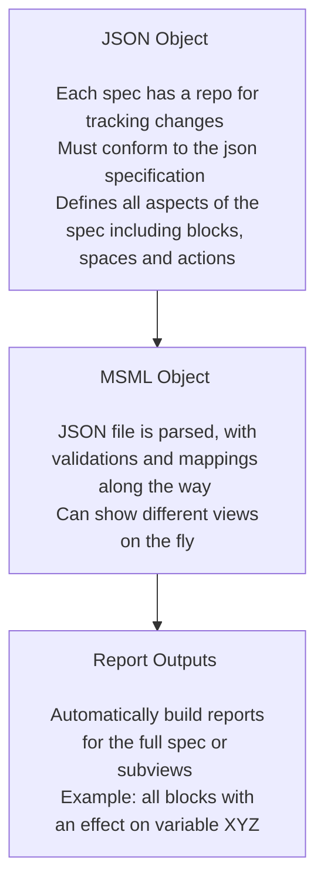

# Annual Presentation

Presented during BlockScience Town Hall on 6/26/2024
Author: Sean McOwen

## Executive Summary

## The Evolving Objectives of the Mathematical Specification Mapping Library Project

### Prior Objectives

- "Writing mathematical specifications can be a difficult process, especially when variable names are changed or new mechanisms are introduced. MSML seeks to streamline the process with automations as well as enhance the abilities of static math specs to deliver deeper insights. Because it is automated, one can write specifications at different levels of details or for different purposes."
- Ideation Tool for Client + R&D Work
- Accelerates cadCAD Modeling
- Bridges GDS and Software Implementation

### Evolving Objectives

- MSML as a Rosetta Stone between groups, programming languages and paradigms
- MSML as a tool to enhance iterative development in end-to-end / full life-cycle systems engineering

## Year in Review, by the Numbers

- Current production repository started on December 2023, old repository disregarded in these counts as POC work
- 244 Issues Closed
- 619 Commits of Code
- 28 releases on pypi over the last year

## Year in Review, by the Topics

## Client Deployment Retrospective

## Research Notes Roster

## Canonical Examples Roster

## Future Plans

## A Thank You to All Supporters

## Questions?