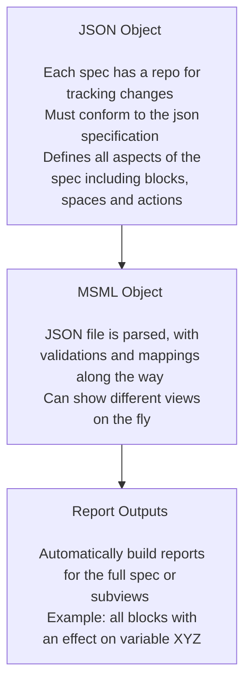
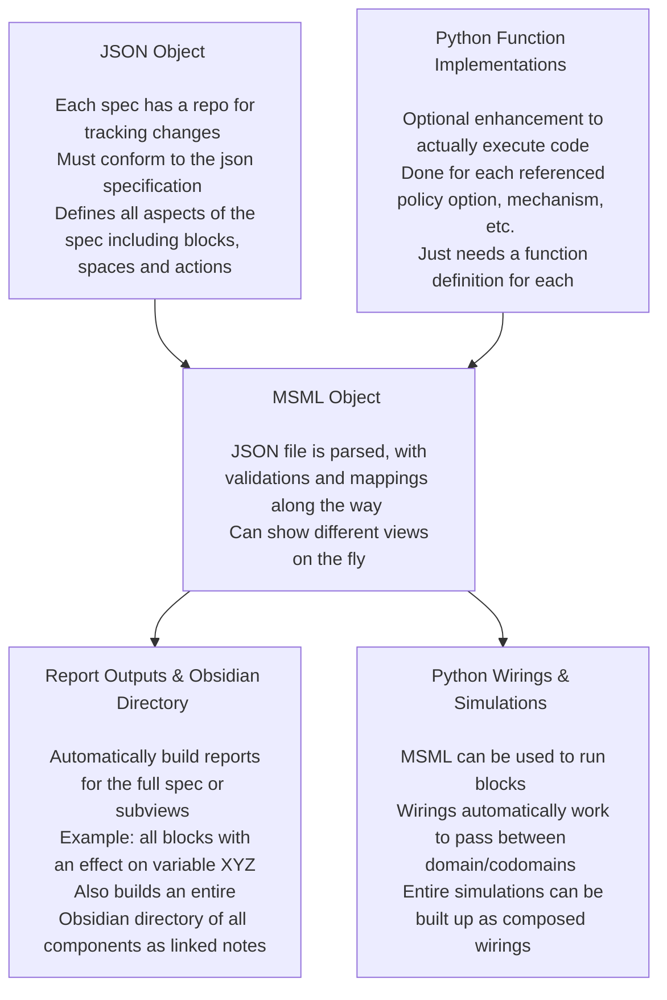
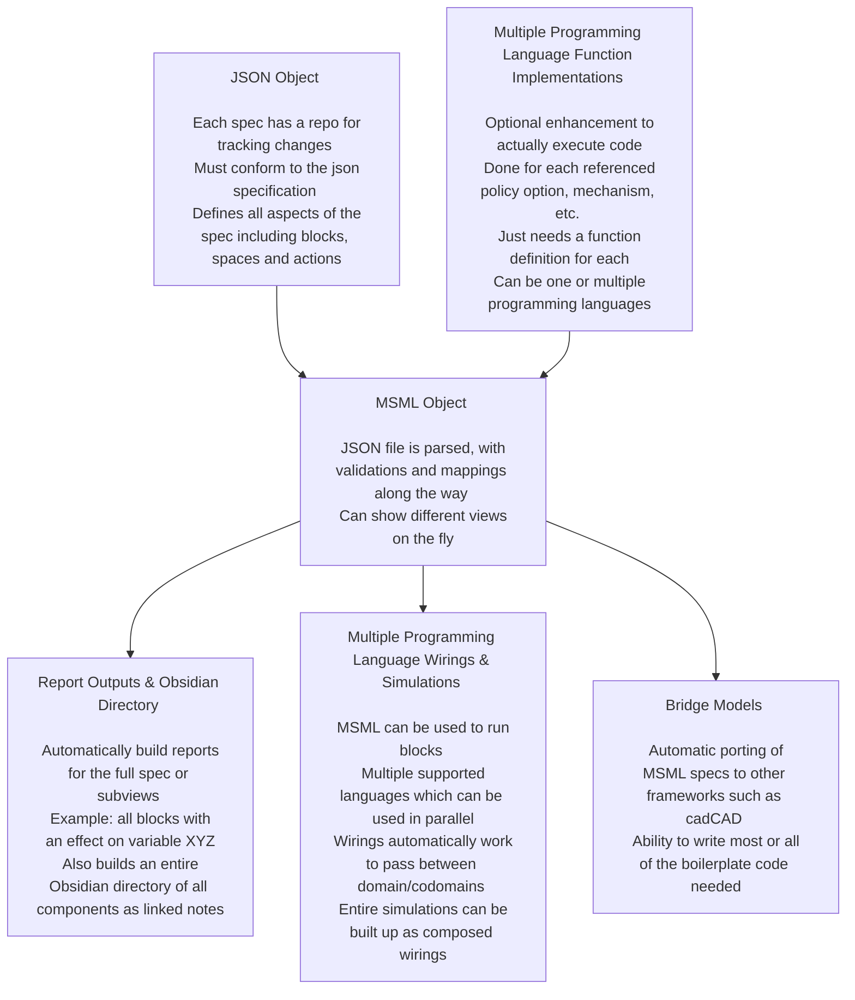

# Annual Presentation

Presented during BlockScience Town Hall on 6/26/2024
Author: Sean McOwen

## Executive Summary

The mathematical specification mapping library is now being used across many projects and is evolving very quickly. For example, as of late, it can run full simulations by binding python implementations of blocks and a lot of time is going into perfecting it. This presentation will give a full overview of the last year as quickly as possible. To that end, please save questions until the end as the presentation time slot is only 15 minutes.

## The Evolving Objectives of the Mathematical Specification Mapping Library Project

### Prior Objectives

- "Writing mathematical specifications can be a difficult process, especially when variable names are changed or new mechanisms are introduced. MSML seeks to streamline the process with automations as well as enhance the abilities of static math specs to deliver deeper insights. Because it is automated, one can write specifications at different levels of details or for different purposes."
- Ideation Tool for Client + R&D Work
- Accelerates cadCAD Modeling
- Bridges GDS and Software Implementation

The old version of MSML architecture

### Evolving Objectives

- All prior objectives as well as:
- Treating MSML as a Rosetta Stone between groups, programming languages and paradigms
- Thinking of MSML as a tool to enhance iterative development in end-to-end / full life-cycle systems engineering with capabilities for all phases of the engineering lifecycle

The most recent version of MSML architecture:

The future version of MSML architecture:

## Year in Review, by the Numbers

- Current production repository started on December 2023, old repository disregarded in these counts as POC work
- 244 Issues Closed
- 619 Commits of Code
- 28 releases on pypi over the last year

## Year in Review, by the Topics (High Level Only)

- MSML migrated to wirings and GDS; stack block, parallel block, and split block are now all fully functional and composable with specialized checking for domain/codomain of inner components
- Graphics engine was completely overhauled and replaced with Mermaid which just need some scripting code and then can run be rendered in any markdown enviroment
- An Obsidian/Wikilinks styled directory is automatically created now which builds all components as their own pages and backlinks between all the connections
- A JSON specification was built for both validation purposes of the JSON as well as auto-created documentation
- Four canonical examples in progress
- Variety of completed tasks around quality of life improvements, documentation and debugging
- Implementations/Code Enabled Blocks were created whereby a user can now write out python functions that implement a block's policy option, mechanism, etc. and they can be run as actual code. This works as well with entire wirings that will automatically pass the domains/codomains between the blocks as long as they are properly defined in the implemenetations.
- Some progress has been made on metaprogramming / cadCAD bridges for automatically writing an entire cadCAD model in both julia or python given the implementations are there. Future work involves things such as auto-generated documentation from the component data and automatic assertions/checking added for domain/codomain.
- A large roster of research notes have been produced as part of the project and are detailed below

## Client Deployment Retrospective

- There were 4 client projects where MSML was utilized for creating a mathematical specification and 1 which is currently using it for specification plus the new executable blocks functionality for running simulations before moving to a cadCAD model
- Overall the deployments went well but there is room for improvement with:
    - Improving clarity, especially for less technical stakeholders
    - Improving onboarding for those using the library
    - Improving the GUI and interfaces for easier development of specs
    - Improving documentation and boilerplate "Introduction to MSML" materials for those not familiar with GDS or MSML

## Research Notes Roster
- All research notes are available [here](https://github.com/BlockScience/MSML/tree/main/research_notes)
- The notes are split across new ideas, proposal plans for new features & updates on recent progress

### Roster of New Notes from the Last Year

- 2023-12-15 v0.1.0 Update: Gives a high level view of all the work prior to the recent production repository creation
- 2024-01-23 Model Evolution: First attempt at thinking through how MSML can support end-to-end development from spec all the way to digital twin
- 2024-02-25 v0.2.2 Update: Development updates from v0.1.0 to v0.2.2
- 2024-03-31 V0.4 Roadmap: A plan for what to accomplish in V0.4
- 2024-04-05 V0.3 Update: Development updates from v0.2.2 to V0.3.0
- 2024-04-15 Guided Example: An example of how to build a model from pre-spec to specification; this is being improved to be used as a full on canonical example and the guide for getting started with an example in the future
- 2024-04-18 Metrics Working Group: A research note on work being done for better defining of metrics and stateful metrics
- 2024-05-03 Parameter Class Naming: A research note on parameter class names and different ways that it could be implemented (plan is for a "bring your own ontology" approach moving forward)
- 2024-05-15 Latex Escape Characters Issue: Development note on working through an issue with Latex escape characters
- 2024-05-15 V0.3.3+ Proposals: Development research note for future proposals of changes to MSML

### Roster of Work in Progress Notes

- WIP Obsidian and MSML: A research note that will be presented for the governance pod on using both Obsidian and MSML for pre-spec work leading into end-to-end development
- WIP SysML Research: A research note on SysML and ideas that might potential be used to improve MSML
- WIP V0.4 Update: The development update for V0.3.0 to V0.4.0

## Canonical Examples Roster

1. Starter Repo: A repo that is meant to be used/forked to begin the process of writing a spec. Has one component for each component class and shows how to use the executable block functionality.
2. Root Finding Simulation: One of the most fleshed out canonical examples which shows a specification for testing root finding algorithms, some progress is being made on finalizing the spec and early progress on executable blocks
3. Retirement Planning: Canonical example which will serve as a guided example in the future, implemented in a very basic spec form but is going to be heavily improved upon for an easy user experience of doing a first example
4. Rideshare Model: A canonical example that Sayer Tindall is creating and I am helping on which should serve as a very deep example of the entire process of end-to-end model building

## Future Plans

1. Clear out the remaining 165 issues (which will inevitably become much more as new ideas or bugs are discovered)
2. Continue testing the library with client projects
3. Finish all 4 canonical examples and consider any other future canonical examples
4. Finish creating the bridge to cadCAD so that a model can easily be handed off from spec to cadCAD
5. Create a GUI for easy spec creation
6. Promote the project and community build

## A Thank You to All Supporters

It takes a village, and there are too many of you to name. Thank you to everyone who has patiently tested out features with me, provided feedback and otherwise been a supporter of the project!

## Questions?