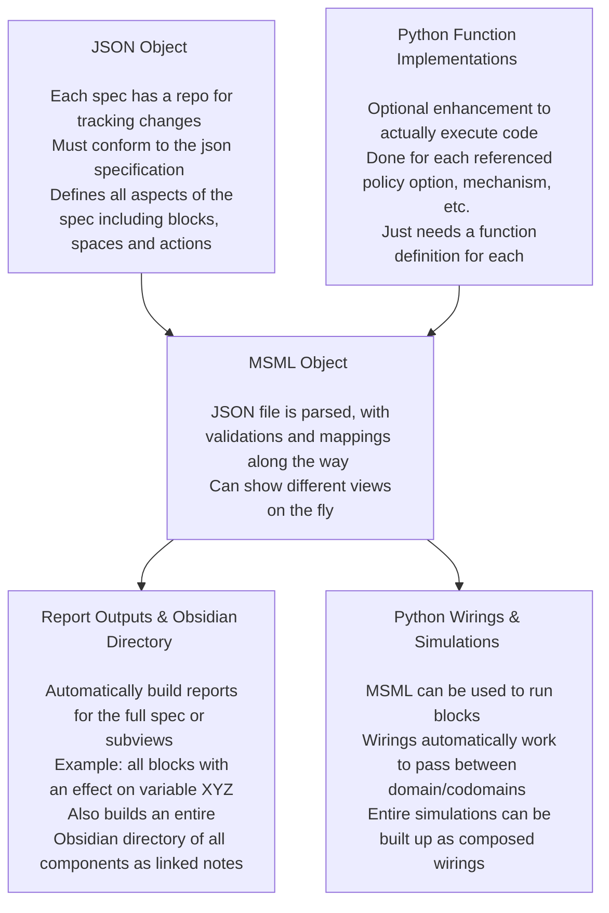
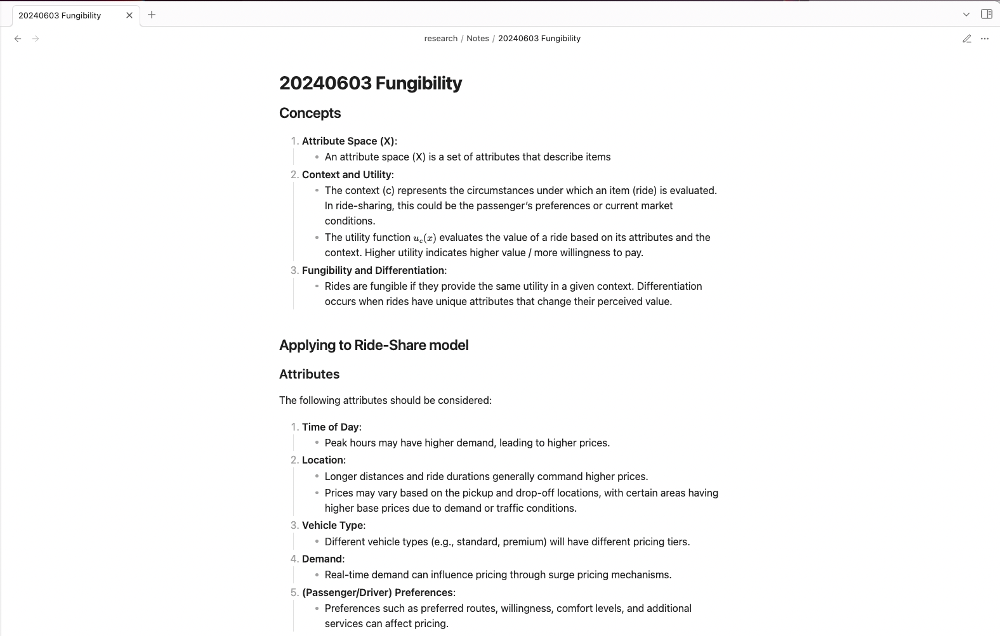
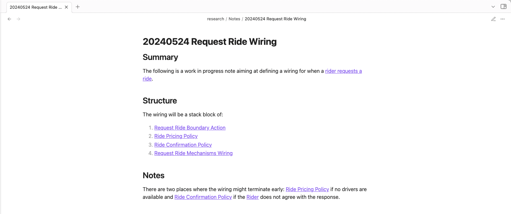
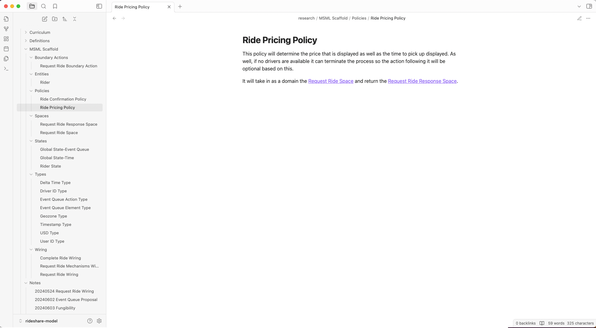

# Obsidian, the Mathematical Specification Mapping Library, and End-to-End Modeling

<b>7/3/2024</b>

<b>Sean McOwen</b>

Created as a presentation for the BlockScience governance pod.

## Executive Summary

End-to-end modeling often creates information overload because of how many different stakeholders and paradigms it touches on. There are so many different considerations one might take into account such as economic incentives, feasibility or complexity for software development or data storage/processing concerns just to name a few. Both Obsidian and MSML serve as tools to help organize thoughts across the end-to-end modeling process. 

This presentation will broadly present on Obsidian and MSML as tools for end-to-end modeling but try to touch upon specific governance examples and considerations.

### And how does this apply to governance?

While it will be weaved in throughout this presentation, the high level relations to governance are:
1. Obsidian can be used as a tool for collating the artificats of different groups and linking them together to support interdisciplinary collaborations in an organic way
2. Both Obsidian and MSML can be used as a log of prior work that went into decision making so that different stakeholders can quickly see and understand the context
3. MSML functions as living documentation of systems, and as such stakeholders can quickly see what past implementations or options were (through the policy options) as well as what the current documentation of the system is
4. Model governance is a part of end-to-end modeling and these tools can be used on many of the those levels

## Agenda

1. Introduction to End-to-End Modeling / the Engineering Lifecycle
2. An Introductory Example - Model Governance at Banks... Tales from my First Job
3. Introduction to Obsidian for Networked Thinking
4. Introduction to MSML
5. MSML in the Engineering Lifecycle
6. Governance Considerations
7. Further Ideas & Thoughts for Future Experimentation

## Introduction to End-to-End Modeling / the Engineering Lifecycle

The engineering lifecycle as defined and visualized in ["Block by Block: Managing Complexity with Model-Based Systems Engineering"
](https://blog.block.science/block-by-block-managing-complexity-with-model-based-systems-engineering/) is depicted below.

End-to-end modeling is building through the full lifecycle; some of the tasks that might be done as part of this could be:
1. Gathering sources of information and doing a literature review to understand the problem in depth
2. Speaking to stakeholders to create a list of requirements from what their needs are, i.e. things such as privacy of user information or economic requirements like a low level of volatility in the returns of an asset
3. Creating tests in a programming language to check the software is properly running
4. Creating documentation on the model
5. Building a simulation framework of the model
6. ...and so on

## An Introductory Example - Model Governance at Banks... Tales from my First Job

The Federal Deposit Insurance Corporation (FDIC) has a great [guide for model governance](https://www.fdic.gov/regulations/examinations/supervisory/insights/siwin05/siwinter05-article1.pdf) which I will cite below mixed with personal experiences. Model risk is what good model governance aims to mitigate, which the FDIC describes as "the potential for model output to incorrectly inform management decisions."

The important thing to note here is that banks have more than just themselves to worry about. Prior the financial crisis, quants created a slew of complex derivatives that forced the need to recruit physics PhD and math olympiad winners to model them (these two traits are still to this day highly sought after, some recruiters will explicitly ask for math olympiad winners and "The Big Short" had a scene dedicated to it). Unfortunately most of them failed to correctly model correlations being non-static (or were asked not to by their managers to make the model look much more attractive). The thing is, these banks are not holding the assets on their books (or at least are not the majority holders of it), they are creating them to <i>sell</i> usually. And the buyers are often times large institutional investors such as pension funds, Michael Lewis gives some of the finer points of it in his book "Flash Boys". When these models were wrong and the market blew up, it wasn't just the banks who were in trouble, so were the pensions of millions of people where there were now funding shortfalls.

So they actually have stakeholders in who they sell to, but does that translate into action? Even if pessimistically we might think they will shirk the responsibility, through regulatory and legal channels they can be fined, banned from operating in markets, etc. Anecdotally when I first started my career I wanted to be a quant working on complex derivatives. However, when I asked around I found out two things. One, the market is so highly regulated that as one senior person said: "You need twice as many people for the same work because the regulatory and model governance takes up just as much time as modeling". And two, as a result of one, the market had shrank significantly.

At my first job, I did quantitative modeling for the Comprehensive Capital Analysis and Review (CCAR) submission which the Fed mandates large banks undergo to stress test in case of a future financial crisis scenario. Many of the things I learned there are things which not only are a part of good end-to-end modeling but also can be improved upon using Obsidian and MSML. Some of the examples are:
1. The requirement of having economic intuition behind how the model works; a statistically signficant p-value doesn't count if you are predicting the volume of bank deposits by using an independent variable of the number of streams that Drake has on Spotify.
2. Ensuring robustness by testing through a range of regimes and scenarios, in CCAR the final scenarios are not known beforehand but the models are "locked in" so it is essential to test that a model is robust and not just giving one the results they want in a given scenario
3. Creating a testing and validation process with both automation and coverage of edge cases in mind
4. Meeting with stakeholders (in this case the business unit heads) to source the information and data that will provide the strongest model
5. Documenting extensively how decisions were come to, in this case keeping minutes of every single meeting with business unit heads and presentations to committees on proposed models

## Introduction to Obsidian for Networked Thinking

- Obsidian is a note taking app that allows one to make "wikilinks" that connect different notes to one and other
- With the edge connections between notes, there are graph features to explore the relation of different concepts and ideas
- As well there is support for creating canvases for brainstorming and ideation
- Finally, it can be extended with plugins from the community
    - For example, the plugin [dataview](https://blacksmithgu.github.io/obsidian-dataview/) allows one to create queries on the documents in the vault to do things like pull notes that link to a given note or pull all notes that contain a certain tag
- In the rapid prototyping section we will show specifics of how it can be utilized

## Introduction to MSML

### What is the Mathematical Specification Mapping Library (MSML)?

MSML is a library for standardizing the creation of mathematical specifications as JSON objects as well as aiding in the automation of report and visualization creation from these standardized JSON. 

It uses block diagram wirings and spaces to represent the actions in complex systems in line with current BlockScience research on Generalized Dynamical Systems. It also adds some enhancements to the primitive blocks to represent richer sets of behaviors.

### What are some of the solutions offered?

- **Automation**: Automate writing of a specification
- **Standardization**: Ensure standardization across teams working to spec out a system
- **Flexibility**: Allow for creating views on the fly and in multiple ways depending on what stakeholders find important
- **Trackability**: Keep a repository of a JSON file to track changes to the spec with the same enhancements git provides for projects already

### How does MSML work?

## MSML in the Engineering Lifecycle

MSML can aid in all five of these phases in different ways.

### Ideation and Conceptualization

During ideation phases, users of MSML can leverage the markdown writing tool to begin organizing different thoughts into components. For example, if one were trying to model a system that has multiple currencies, i.e. USD and the Euro, those could be added in as MSML types as they are discovered. The markdown report writing supports wiki-links for use in Obsidian or a similar tool allowing users to iteratively catalog different components they find in their research and ideation. 

### Requirements and Design

When moving into requirements and design, MSML provides a suite of reports so that presentations to stakeholders can be insightful but tailored to the different audiences. Feedback can be iteratively incorporated into the spec with reports being re-run.

### Implementation, Integration, and Testing

In its basic form, a spec from MSML can be used to guide implementations because blocks can be transformed into actual code/functions and spaces act as the parameterizations of those functions. There is also experimental work being done on meta-programming so that MSML could either template simulation models or even be used to hold and write code where applicable for things such as A/B testing.

### Operations and Maintenance

Thanks to some of the more advanced features, MSML can be used as an aid for debugging and system validation. The functionality around seeing what parameters effect which blocks directly or downstream indirectly helps developers quickly identify root causes of issues. The linkages between mechanisms and what pieces of state they update allows for developers to quickly see all possible paths to variable changes there are in case something looks amiss.

### Governance and Evolution

The ability to fork the repository of an MSML spec as well as the ability to use it for A/B testing with the policy options makes it well suited for iterating on model evolution. 

## Rapid Prototyping with Obsidian and MSML

- A tight feedback loop can be executed with Obsidian and MSML for prototyping and model development
- The key is to use Obsidian for the bulk of the information and curation which can then be parsed into MSML components as more clarity is derived

### Rideshare Model Canonical Example

- The [Rideshare Model](https://github.com/BlockScience/rideshare-model) is a work in progress canonical example that Sayer Tindall is leading with help/advisory from Sean McOwen to model how the economics of a rideshare platform might be modeled
- Notes can be added with work in progress thoughts as markdown files, i.e. information gleaned from talking with subject matter experts such as the below note:

- Proposals can also be created to present to stakeholders on implementation/modeling choices, for example the following below shows a proposal for how to model request a ride. Note the backlinks which can be clicked to go to the notes referenced.

- Before jumping into actually creating a spec, one can make a scaffold in the Obsidian vault to try and work through conceptually what components will be required.

- Then, iteration can begin on the spec. MSML will take in JSON representations, then build the spec from it and do all validations plus report creation. One of those reporting outputs is the Obsidian markdown directory that creates and links automatically all the different components. Below we can see (1) the JSON that created the pricing policy (2) the outputted MSML note on the policy (3) the spec tree at the current time which shows all the components so far implemented.

- A note on recursive requirements: 

- The wiring diagram

- Implementations

- Simulation

## Governance Considerations

### MSML as a Living Document of Policy Proposals and Changes

- Given policies, we know the broad scaffold of how things look and then we can define out different policy options that might be used. Different stakeholders may respond differently to different solutions but MSML allows for tracking the options as well as potentilly simulating the different options.
- Git history allows an extra benefit of knowing when different things were added in, changed, etc.
- Because of the ways that the system can be zoomed in on, one can automatically create different reports tailored to different stakeholder groups

### Obsidian x MSML for Tracking of Ideas

- Together both of these resources can be used for collating ideas
- Different proposals can be saved for potential future discussion by being added in

## Further Ideas & Thoughts for Future Experimentation

TBD