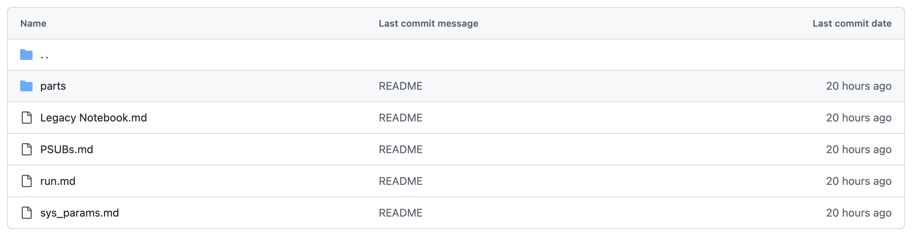

# Predator-Prey Reverse Engineering Example

## Executive Summary

- As part of an effort to make high quality canonical examples, a predator-prey model is being iterated on to show a full end-to-end modeling workflow and the repository can be found [here](https://github.com/BlockScience/Predator-Prey-Canonical-Example)
- Today we will go through the process of reverse engineering a past repository of code and updating it to be an MSML-compliant spec
- This specific type of ideation is often done when presented with a system that is already in a production enviroment but needs to be modeled through simulations or digital twins

## Predator-Prey Background

- The Predator-Prey model is often used as an example in mathematics classes to illustrate equilibrium behaviors and modeling for it
- Generally, the model is for representing the Lotka–Volterra equations, which are first order, non-linear differential equations
- However, for our purposes, and purposes of the legacy model, we impose a discrete time to the system and model it instead as an agent-based simulation
- The legacy model used comes from the [cadCAD demos repository](https://github.com/cadCAD-org/demos/tree/master/demos/Agent_Based_Modeling/prey_predator_abm) and is ported into Obsidian
- Let's quickly look at what the old model looked like!

## Predator-Prey Reverse Engineering Ideation

- The [Predator-Prey-Ideation repository](https://github.com/BlockScience/Predator-Prey-Ideation/tree/main) is the repository for the ideation phase of the canonical example. Currently reverse engineering code is the only example but there will be more in the future.
- Legacy code review is done to take a current version of a system and break it down into MSML/GDS style blocks and spaces
- It can be free form but overall the goal should be piecing together the beginning of a scaffold to be ported into MSML
- This can also be done in tandem with a literature review
- The steps followed were:
1. Port all relevant code into the "Legacy Code Review"
2. Create the folder of "MSML Scaffold" and start to link pieces of the legacy code files to their counterparts in an MSML scaffold
3. A second "MSML Scaffold 2" folder was created and copied over from "MSML Scaffold" with a canvas for organizing the wirings so that it could be refined (this can be done in one folder normally but for illustrative purposes was broken out)
4. The "write_issues.ipynb" notebook was used to automatically write issues from the scaffold into the MSML repository which is where the next steps will come in

### Code Porting

- The folder of Predator-Prey-Obsidian-Legacy-Code was created and then markdown files were created to map directly to the legacy code

- Each section had its code pasted in, for example, the code for "parts/agents":

### MSML Scaffold 1

- For the first round, an MSML scaffold was built out to hold different components that were gleaned from reviewing the code
- Each part of the Predator-Prey-Obsidian-Legacy-Code folder had a #WIP at the top to denote that it still needed to be parsed in
- For example, the PSUBs code was used to scaffold what the wirings loosely should be:

- And code can be copied into specific notes, such as the wiring shown below

- Some more notes were added to the scaffold but if you look it will not be complete, rather we can refine once we finish porting all the code and baseline structure we want