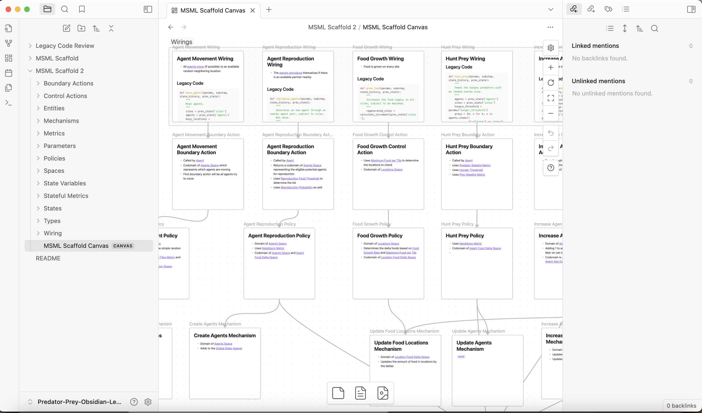
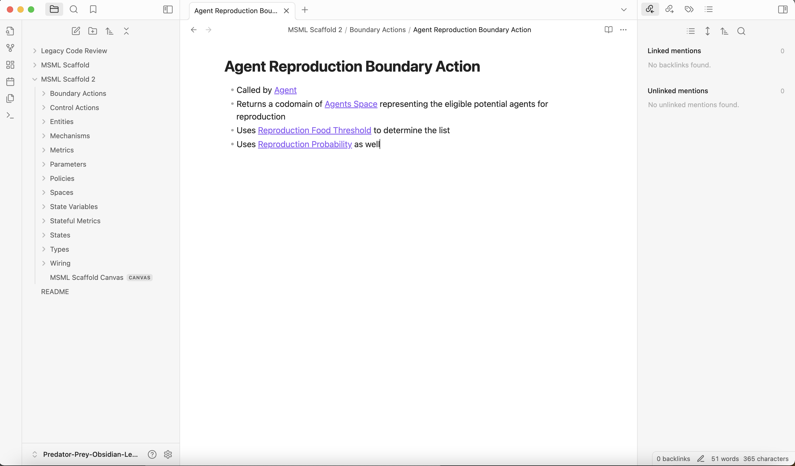

# TPM Pod Presentation

## Executive Summary

- This research note covers the important aspects of MSML as they relate to the technical project manager pod at BlockScience
- The primary question is how can TPMs support building of an MSML spec

## Internal Communications

- The primary way that MSML can aid internal communications is through having one working copy of the current specification of the system
    - It is highly recommended to use a git repository so that changes can be tracked easily for the different components
- The "Documentation & Reporting Outputs" covers the ways in which the spec itself can be put into many representations depending on the depth one wants to go in understanding the system generally or specific wirings and blocks
- Also important to note, the spec can be iteratively filled in - for example one could scaffold out only the blocks and spaces first, present the current wirings for confirmation to team members and only then begin to iterate on describing each component
- The example flow will make it clear how all these things could play out together

## External Communications

- The pieces from "Documentation & Reporting Outputs" are also meant to be client facing, but one can decide what is shown
- For example, a session with a client might revolve around one specific wiring in which case the obsidian vault could be utilized to show the wiring but also have the ability to poke into the components

## Documentation & Reporting Outputs

- **Obsidian Vault**: An obsidian vault can automatically be created to have all system components written as markdown files with linking between them. They are best viewed in Obsidian, but this document can be used to quickly jump between high level wirings and atomic components to align either internally or externally. An example of it is the [predator-prey vault](https://github.com/BlockScience/Predator-Prey-MSML/tree/main/reports/obsidian).
- **Glossary Report**: MSML can write markdown files and then translate them into PDFs. One of those reports is the glossary report which just gives the overall inventory of all components and their descriptions. An example is [here on the MSML template](https://github.com/BlockScience/MSML-Template/blob/main/reports/Glossary.pdf).
- **Additional Work-in-Progress Reports**: There are many other PDF reports in progress including ones that wrap everything needed to understand a wiring into one single report.

## Design, Modeling & Simulation

- Without going too into technical details, there are two ways to use MSML for simulations, both require binding code to the blocks, but are slightly different
- MSML's engine for running a simulation allows for defining out in great detail all the experiments to run, for example, this [notebook](https://github.com/BlockScience/MSML-Template/blob/main/notebooks/Experiment%20Simulations.ipynb) shows how in the template a bunch of simulations can be run
- The other option is to create a cadCAD export model which then gives a data scientist an object to use for testing that just needs a state space and parameter space but has all the logic bound into it, for example the template has an example of how to build it [here](https://github.com/BlockScience/MSML-Template/blob/main/notebooks/Build%20cadCAD.ipynb)
- The documentation covers a lot of what needs to be done for running these so we won't dive into details any further

## Where TPMs can be Involved (High Level)

- Information sourcing and curation
- Interfacing with clients
- Validation

## An Example TPM Aided Flow

- We will work through an example of how we might break down a simple project with iteration loops involving TPMs
- We will leverage the current canonical example in progress - the Predator Prey model
- In the resources section there is a previous research note that details how to do reverse engineering of existing code into an MSML scaffold 
- I will add the following symbol to denote where TPMs especially could help out: 🎯

### Phase 1 - Information Sourcing & Requirements Engineering

- This phase focuses on digging through documentation, conversations, etc. to come up with the necessary knowledge for a spec
- 🎯 Having both the MSML engineer, TPMs and other team members collaborate to read through and curate what information from the client is important is a good first step to take collaboratively
    - For example, with predator-prey, it might be be useful to make a list of the entities in the system which will have state. This might be defining out predator entities, prey entities and the entities that represent the actual "tiles" of the grid on which they move
- 🎯 Combining this phase with Obsidian makes it nice to have linking between source documents and working documents
    - For example, if there is a page which is for predator, when reading through some documentation on how if they don't have enough food they die, you might first add some details to the predator file that says they have some state variable for tracking food and then you might also add some notes somewhere that it sounds like there needs to be a wiring for taking care of both food decreasing but also whether a predator dies at any given moment from starvation
- 🎯 Keeping an open question sheet or similar with clients can be useful to keep surfacing where more details are needed and record responses from clients on what the answer is
    - For example, a question might be "what is a reasonable rate at which food depletes from predators, should this be a parameter in the model or fixed to some value?"

### Phase 2 - Scaffolding

- This phase is for everything up until moving over until a formal specification, these are all optional ways to describe the problem before beginning to write the spec
- 🎯 Diagramming such as stock and flow diagrams can help to emphasize what parts of the system must be in scope and what their downstream impacts are
- Writing a high level listing of the wirings (and possibly adding in some of the component specific rough draft) can be useful for alignment with the desire to make sure everything is represented
    - 🎯 TPMs can give a validation or check that the current set of high level wirings would cover all the necesary behaviors
    - 🎯 Presenting to clients for acceptance is also useful
- The MSML engineer might want to start out by creating a scaffold, for example the [scaffold for the predator prey example](https://github.com/BlockScience/Predator-Prey-Ideation/tree/main/Predator-Prey-Obsidian-Legacy-Code/MSML%20Scaffold%202) looks like the following below
    - There is also a feature of MSML that can take this scaffold in terms of folders/files and translate it directly into github issues to make it even more streamlined going from rough sketch in Obsidian to an MSML spec
    - **None of these are required and should only be used if one feels that they are value-add**

- Notes then can be filled in with the components of what will become the JSON representation, such as the "Agent Reproduction Boundary Action":

## A Future Flow: BDP -> MSML -> Code Enabled Specs -> MSML Simulations / cadCAD Simulations

## Additional Resource

- [MSML Website](https://blockscience.github.io/MSML/)
- [Predator Prey Reverse Engineering Research Note](./2024-11-13%20Predator-Prey%20Reverse%20Engineering.md)