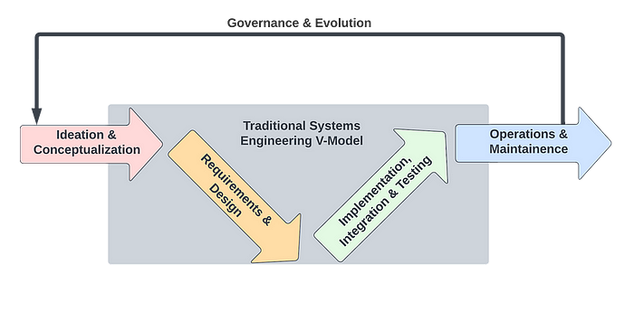

# Obsidian, the Mathematical Specification Mapping Library, and End-to-End Modeling

<b>7/3/2024</b>

<b>Sean McOwen</b>

Created as a presentation for the BlockScience governance pod.

## Executive Summary

End-to-end modeling often creates information overload because of how many different stakeholders and paradigms it touches on. There are so many different considerations one might take into account such as economic incentives, feasibility or complexity for software development or data storage/processing concerns just to name a few. Both Obsidian and MSML serve as tools to help organize thoughts across the end-to-end modeling process. 

This presentation will broadly present on Obsidian and MSML as tools for end-to-end modeling but try to touch upon specific governance examples and considerations.

### And how does this apply to governance?

While it will be weaved in throughout this presentation, the high level relations to governance are:
1. Obsidian can be used as a tool for collating the artificats of different groups and linking them together to support interdisciplinary collaborations in an organic way
2. Both Obsidian and MSML can be used as a log of prior work that went into decision making so that different stakeholders can quickly see and understand the context
3. MSML functions as living documentation of systems, and as such stakeholders can quickly see what past implementations or options were (through the policy options) as well as what the current documentation of the system is
4. Model governance is a part of end-to-end modeling and these tools can be used on many of the those levels

## Agenda

## An Introductory Example - Model Governance at Banks... Tales from my First Job

The Federal Deposit Insurance Corporation (FDIC) has a great [guide for model governance](https://www.fdic.gov/regulations/examinations/supervisory/insights/siwin05/siwinter05-article1.pdf) which I will cite below mixed with personal experiences. Model risk is what good model governance aims to mitigate, which the FDIC describes as "the potential for model output to incorrectly inform management decisions."

The important thing to note here is that banks have more than just themselves to worry about. Prior the financial crisis, quants created a slew of complex derivatives that forced the need to recruit physics PhD and math olympiad winners to model them (these two traits are still to this day highly sought after, some recruiters will explicitly ask for math olympiad winners and "The Big Short" had a scene dedicated to it). Unfortunately most of them failed to correctly model correlations being non-static (or were asked not to by their managers to make the model look much more attractive). The thing is, these banks are not holding the assets on their books (or at least are not the majority holders of it), they are creating them to <i>sell</i> usually. And the buyers are often times large institutional investors such as pension funds, Michael Lewis gives some of the finer points of it in his book "Flash Boys". When these models were wrong and the market blew up, it wasn't just the banks who were in trouble, so were the pensions of millions of people where there were now funding shortfalls.

So they actually have stakeholders in who they sell to, but does that translate into action? Even if pessimistically we might think they will shirk the responsibility, through regulatory and legal channels they can be fined, banned from operating in markets, etc. Anecdotally when I first started my career I wanted to be a quant working on complex derivatives. However, when I asked around I found out two things. One, the market is so highly regulated that as one senior person said: "You need twice as many people for the same work because the regulatory and model governance takes up just as much time as modeling". And two, as a result of one, the market had shrank significantly.

At my first job, I did quantitative modeling for the Comprehensive Capital Analysis and Review (CCAR) submission which the Fed mandates large banks undergo to stress test in case of a future financial crisis scenario. Many of the things I learned there are things which not only are a part of good end-to-end modeling but also can be improved upon using Obsidian and MSML. Some of the examples are:
1. The requirement of having economic intuition behind how the model works; a statistically signficant p-value doesn't count if you are predicting the volume of bank deposits by using an independent variable of the number of streams that Drake has on Spotify.
2. Ensuring robustness by testing through a range of regimes and scenarios, in CCAR the final scenarios are not known beforehand but the models are "locked in" so it is essential to test that a model is robust and not just giving one the results they want in a given scenario
3. Creating a testing and validation process with both automation and coverage of edge cases in mind
4. Meeting with stakeholders (in this case the business unit heads) to source the information and data that will provide the strongest model
5. Documenting extensively how decisions were come to, in this case keeping minutes of every single meeting with business unit heads and presentations to committees on proposed models

## Introduction to End-to-End Modeling / the Engineering Lifecycle

The engineering lifecycle as defined and visualized in ["Block by Block: Managing Complexity with Model-Based Systems Engineering"
](https://blog.block.science/block-by-block-managing-complexity-with-model-based-systems-engineering/) is depicted below.

End-to-end modeling is building through the full lifecycle; some of the tasks that might be done as part of this could be:
1. Gathering sources of information and doing a literature review to understand the problem in depth
2. Speaking to stakeholders to create a list of requirements from what their needs are, i.e. things such as privacy of user information or economic requirements like a low level of volatility in the returns of an asset
3. Creating tests in a programming language to check the software is properly running
4. Creating documentation on the model
5. Building a simulation framework of the model
6. ...and so on

## Introduction to Obsidian for Networked Thinking

## Introduction to MSML

## MSML in the Engineering Lifecycle

## Rapid Prototyping with Obsidian and MSML

- Show how one might build up to the 2024-04-15 guided example
- Create a data table of sourcing documents
- Work through the sourcing process

## Governance Considerations

### MSML as a Living Document of Policy Proposals and Changes

### Obsidian x MSML for Tracking of Ideas

## Extending Obsidian with Plugins

## Further Ideas & Thoughts for Future Experimentation